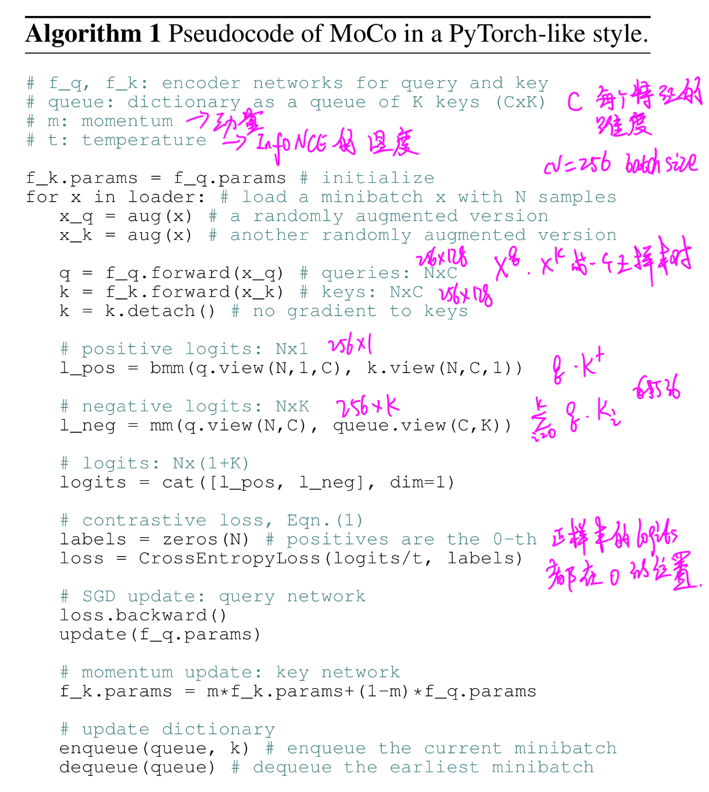
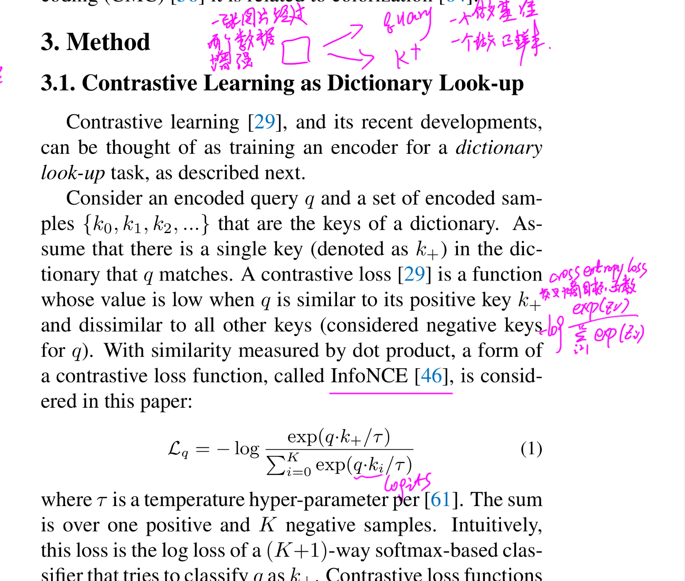

# Moco Note

文章的主要思想：相比于SimCLR属于端到端的结构，但是他是用谷歌TPU运行的，batchsize可以设置很大，保证了负样本队列的一致性；但是一般都没有TPU；一种采用memory_bank的结构，但是里面的样本更新是随机的，负样本队列变化较大；然后MoCO结构两个重要创新点：

1. 字典作为队列，字典的大小与mini-batch(这里可以区分一些mini-batch与batch的概念，目前我们所说的batchsize为多少指的都是mini-batch的大小，所以论文中也可以写成mini-batch代替batch，batch是最初的批量更新算法对所有的样本都遍历完之后再更新参数)先进先出的结构保证了旧的负样本能够及时更新；
2. 动量更新，结构中应该是有两个编码器fq和fk，可以成为查询编码器和密钥编码器(差不多好写就可以，这里叫法随便)，采用的字典过大梯度反向传播很费劲，因为要遍历所有的样本再回传。对fk就可以直接复制fq的参数，忽略样本在fk之间传播的梯度。但是这样仍然存在的问题是fk结构的变化过大，因为fq是采用正样本进行梯度更新的，而我们有需要保证负样本字典中的编码部分更新尽量小；

计算过程：

对于一个mini-batch大小N，设置字典大小K，fq、fk表示两个编码器部分，采用一样的结构复制参数，C表示编码器进行编码后特征的输出维度，m和t表示动量更新梯度和InfoNCE损失的温度值；

**第一步**，fq参数随机初始化，然后将值复制给fk；
**第二步**，遍历dataloader：
**第三步**，对一个mini-batch x进行数据增强，一个xq当作基准，作为query，另一个由于是同样的数据增强，因此是正样本；负样本就是字典中的所有值；
**第四步**，对增强后的数据分别经过编码器进行编码得到k、q，对k进行梯度更新；
**第五步**，计算损失值，这步比较复杂，首先计算q和k之间的乘积代表查询q和正样本之间的距离；l_neg表示q和负样本队列中所有负样本之间的距离；然后计算损失值；先看损失值的定义：
(首先我写的部分不要-log就是softmax，加上之后就成了crossentropy loss，可以直接调用torch库的损失函数定义；对比学习中这个InfoNCE就与这个loss很相似；
先弄明白crossentropy的计算过程，加上batchsize为4，然后有1000个类，那么咱们模型的预测结果应该是(4,1000)的，1000表示每一个类的预测概率；然后label就应该是(4, )，后面表示mini-batch中每一个样本的标签；那么调用crossentropy就可以计算之间的损失值)
同样，对于对比学习中这个损失值一样，将l_pos和l_neg堆叠起来，得到(N, 1+k)的矩阵，这矩阵中我们可以看到正样本都在(N, 0)这个地方，就是说正样本都在第一个位置；那么他的label(N, 1)的矩阵中记录正样本的位置都是0，那么就可以创建一个全0的矩阵就可以了；

**第六步**，损失值反向传播，这里梯度只有q编码器部分，采用动量更新的方法更新k编码器部分的参数，m这个参数表示k编码器参数对下次k编码器的权重，文中设置0.999，就是说q编码器对k编码器部分的参数更新影响很小；
**第七步**，k进入队列，删除队列中的旧值；
