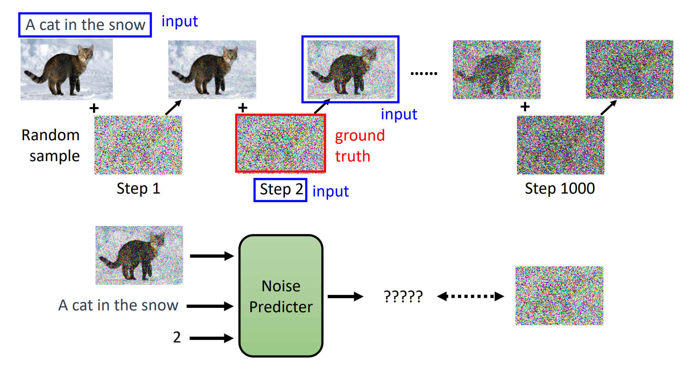
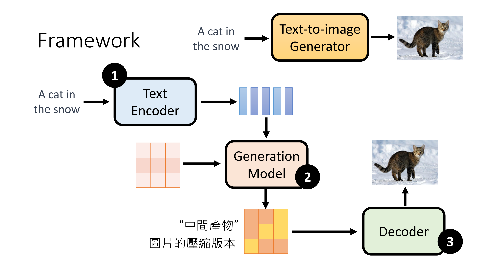
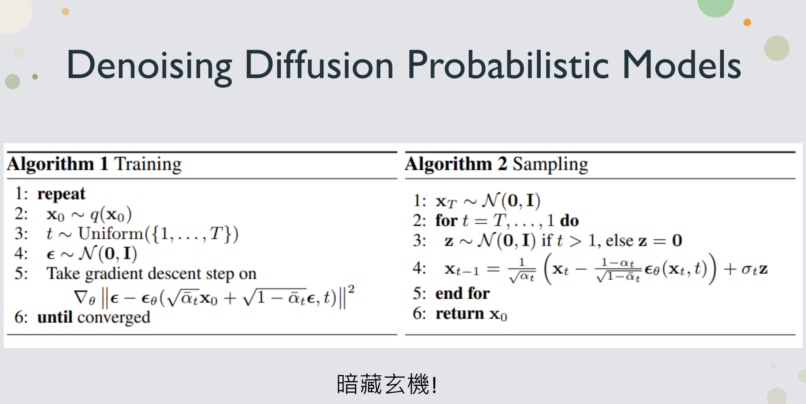

# Diffusion

## Denoising Diffusion Probabilistic Model

去噪扩散模型DDPM

给定一个噪声输入，不断去噪还原影像内容的过程。而在去噪的过程中，使用一个Noise Predicter预测图中所含的噪声，因为噪声的学习会比直接学习影像更加简单。去噪的过程也需要有成对的标签，而标签就是噪声，噪声是加噪的过程中生成的。

## Stable Diffusion

影像生成模型基本上都包含三个部分，text encoder、generation model、和一个decoder。例如Stable Diffusion、DALL-E series、Imagen。

* Text Encoder 用于将文本信息转换为某种讯息；
* Generation Model 的作用在于将文字的信息转换为一种中间产物，可以理解为图片的压缩版本，decoder就可以是一个超分辨率网络；
* Decoder 用于将中间产物转换为图片；

## Diffusion Model

## 参考资料

[李宏毅Diffusion课程](https://www.youtube.com/watch?v=azBugJzmz-o&ab_channel=Hung-yiLee)
