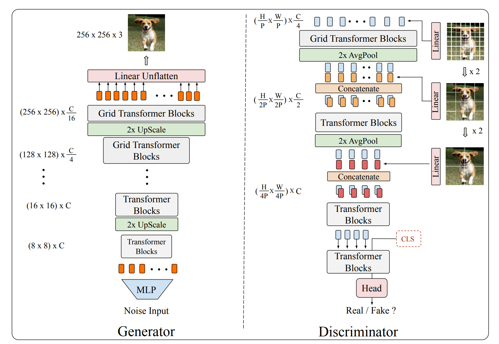
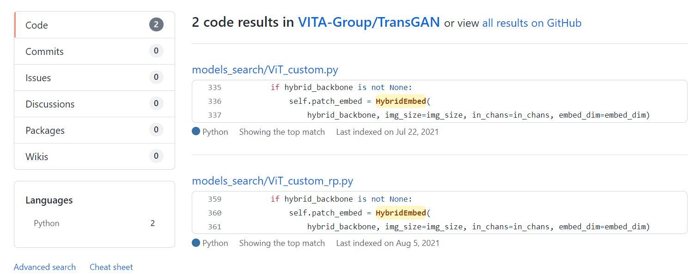

# TransGAN

## 意义

Transformer在分类、分割和检测中已经成为一个通用模型；本文尝试探索Transformer在计算机视觉困难任务上的应用，**尝试构建一个完全无卷积的GAN网络结构**。

## 网络结构



## Generator

生成器采用分阶段逐步提升分辨率生成图像的过程。

## Discrminator

判别器的目的是区分图片的真假，该结构中采用一种多尺度的结构，在不用阶段以不同的图像块作为输入，能够同时考虑语义特征和结构细节信息。

从图中的结构来看，分层结构；先将图像分成P*P个patch，然后通过线性加权将维度改成C/4，后面两层结构类似，只是patch的大小不同。第一层特征逐步降低分辨率然后与后面的特征进行叠加操作；最后在结构末尾添加CLS位置信息，以输出真假预测；

从代码来看：
并没有用到这种多层级的结构，代码库中有个变量一直都是未定义；


```python
def forward_features(self, x):
    if self.args['diff_aug']:
        x = DiffAugment(x, self.args.diff_aug, True)

    B = x.shape[0]
    x = self.patch_embed(x).flatten(2).permute(0,2,1)  # x (1, 64, 64) 第一个64是64个patch块，第二个64是通道

    cls_tokens = self.cls_token.expand(B, -1, -1)  # stole cls_tokens impl from Phil Wang, thanks
    x = torch.cat((cls_tokens, x), dim=1)  # x (1, 65, 64)
    x = x + self.pos_embed
    x = self.pos_drop(x)
    for blk in self.blocks:
        x = blk(x)
    x = self.norm(x)  # x (1, 65, 64)
    return x[:,0]  # (1, 64) 返回第一个位置的值

def forward(self, x):
    # x (1, 3, 64, 64)
    x = self.forward_features(x)  # 特征提取过程  x (1, 64)
    x = self.head(x)  # 线性层转换为2分类真假预测问题 (1, 2)
    return x
```
