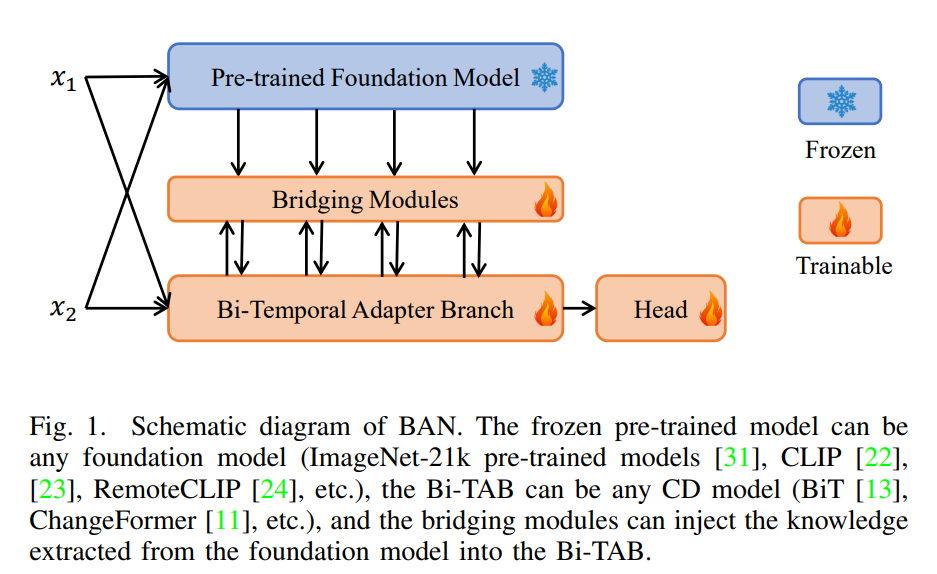

# A New Learning Paradigm for Foundation Model-based Remote Sensing Change Detection

最近的深度学习变化检测方法较多，但是在某一具体数据集上的效果提升很少，不足3%。这主要是因为具体变化检测任务数据少。因此作者认为与其用小模型在具体任务上训练，不如直接采用基础模型微调。

* 分别对前后时相影像采用基础模型提取通用特征；
* 采用已有的变化检测模型例如BIT，分别对前后时相提取变化领域的特征；
* 通过桥接模块将通用特征注入变化特征中；

