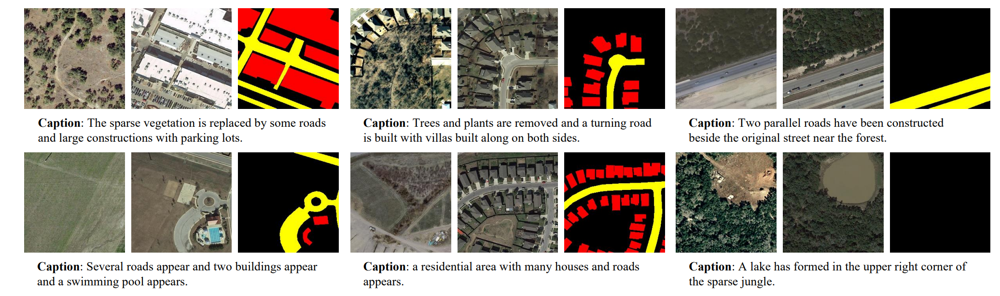

# Change-Agent: Towards Interactive Comprehensive Remote Sensing Change Interpretation and Analysis

观测地表方面的变化对于理解人类影响是至关重要的。遥感卫星影像为观测这些变化提供了一个特别的角度，导致了遥感影像变化理解（remote sensing image change interpretation, RSICI）是一个重要的研究重点。现有的RSICI包含变化检测和变化描述两个方向，每一个方向都有一定的限制。为了解决这个问题，提出了一种可交互的Change-Agent，可以根据用户的指令实现综合的变化理解和分析，比如变化检测、变化描述、变化物体统计、变化原因分析等。

贡献点：

* 构建一种多层次的变化理解（multi-level change interpretation）数据集。基于LEVIRCD数据集，添加了变化描述；
* 提出一种双分支MCI模型，提供基于像素层次和语义层次的变化理解信息。除此，提出带有LPE、GDFA的BI3层加强模型的变化理解能力；
* 基于MCI模型和LLM，构建了一个Change-Agent，实现交互的综合理解分析地表变化，具有智能对话和定制话服务能力，为遥感智能应用提供了新思路；

文章提出了一个变化理解的数据集，提出了一个多任务训练变化理解模型，然后结合LLM实现智能应用；

变化检测方法能够有效定位到变化区域，但是缺乏更深层次的语义信息，包括地物目标的类别、颜色、形状的，空间联系besides、around等，变化的状态appear、removed。而变化描述能够提供详细的语义信息，但是难以提供准确的变化定位。

代码解析：

训练分多阶段进行，第一阶段先训练描述任务和检测任务；第二阶段训练描述任务，第三阶段训练检测任务。

数据集展示：

每一对变化检测样本都提供了一个变化检测掩码，和对应的5个变化描述句子。数据集根据论文所说，应该是人工标注的描述。

在代码训练过程种，提供的mask标签根据颜色的不同划分成了建筑物变化和道路变化，5个句子根据提供的词汇表进行了编码，然后随机取一个值作为该影像的描述；

网络结构介绍：

encoder: segformer mixtransformer作为骨干网络，提取四个尺度下的影像特征；

encoder_trans: 和普通的变化检测类似，从4个不同尺度下的特征进行解码，获取预测的变化检测结果，这里的变化检测结果包含三个类别，不变、建筑物变化和道路变化；变化文本描述从最后一个尺度下的特征进行解码；

decoder: 对caption特征进行解码，涉及RNN的相关函数；

整篇文章结合了多类别变化检测任务和变化文本描述任务，多阶段训练实现了模型的多种输出。
