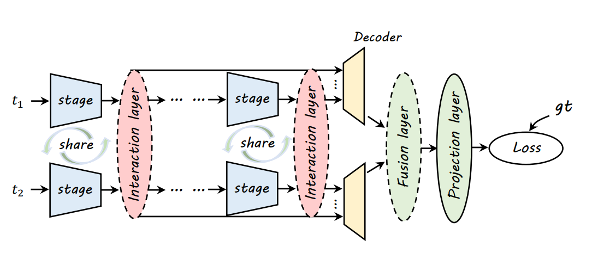
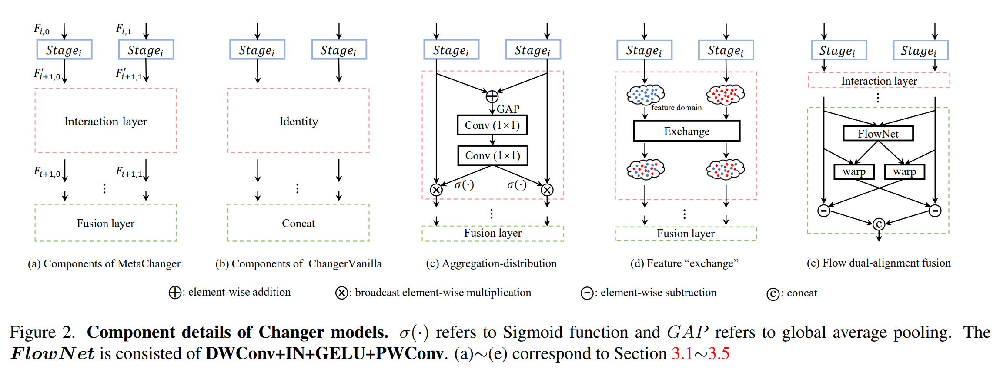
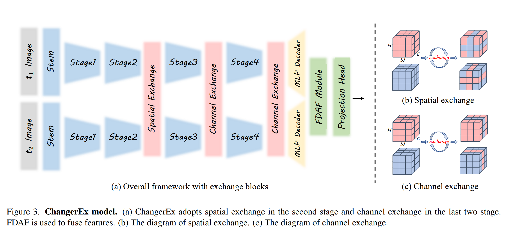

# Changer: Feature Interaction is What You Need for Change Detection

不同于其他密集型任务，变化检测中有意义的操作在于双时相特征的交互。受到这个启发，作者提出了一种变化检测结构，MetaChanger。

通过共享权重的孪生网络，提取双时相特征，进行特征交互；进行decoder之后进行特征融合输出二值图；

包含多种结构：

基础结构 ChangerVanilla 没有交互层，直接使用concat作为融合层；
ChangerAD 受到注意力机制的启发，采用Aggregation-distribution；
ChangerEx 在特征提取过程中双时相特征的部分特征交换；
结构如下：

包含一个Spatial Exchange和两个Channel Exchange。Spatial Channel在通道维度上连续，而Channel Exchange则交换通道维度。
