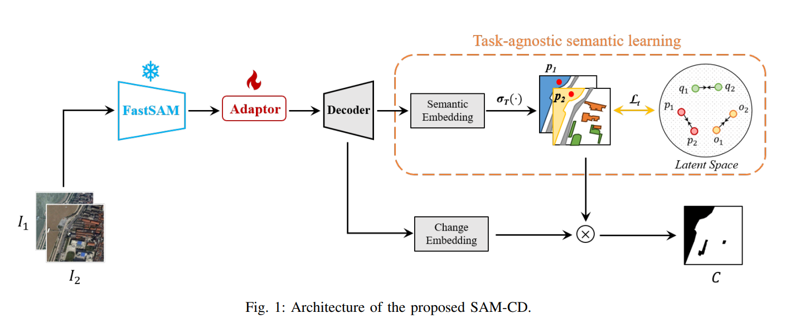

# Combine Sam with ChangeDetection

文章链接：[Adapting Segment Anything Model for Change
Detection in HR Remote Sensing Images](https://arxiv.org/pdf/2309.01429v1.pdf)

贡献点：

1. 提出一种SAM-CD框架，SAM-CD采用FastSAM，首次在遥感影像变化检测任务中采用视觉大模型结构；
2. 在变化检测框架中引入task-agnostic的图像潜在内容学习，监督多时相特征中的语义特征相似性；

网络思路：

1. 固定FastSAM，提取影像特征；
2. 一个可训练的adaptor，更好地对遥感影像进行概括；
3. 通过softmax函数对语义特征进行分类，然后与真实的变化标签相乘，保证变化区域内的语义差距更大；
