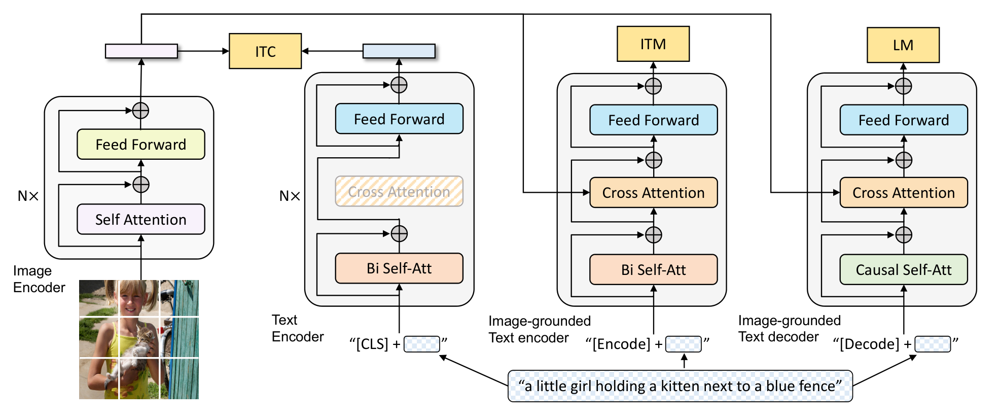

# BLIP: Bootstrapping Language-Image Pre-training for Unified Vision-Language Understanding and Generation

<!-- omit in toc -->

文章链接：[LIP: Bootstrapping Language-Image Pre-training for Unified Vision-Language Understanding and Generation](https://proceedings.mlr.press/v162/li22n.html)
代码链接：[CLIP](https://github.com/salesforce/BLIP)

## 贡献点

* 编码器-解码器的多模态混合结构MED，用于多任务预训练和灵活的迁移学习的模型结构。它可以是单模态的图像编码器、基于图像的文本编码器和基于图像的文本解码器。使用三个视觉语言目标联合训练，图文对比损失ITC，图文匹配ITM，图像条件语言建模LM
* 标题和过滤（CapFilt），从有噪声的图文数据集中学习的引导方法，captioner对图像合成描述，filter从原始网络文本和合成文本中移除噪声文本。

## 模型

