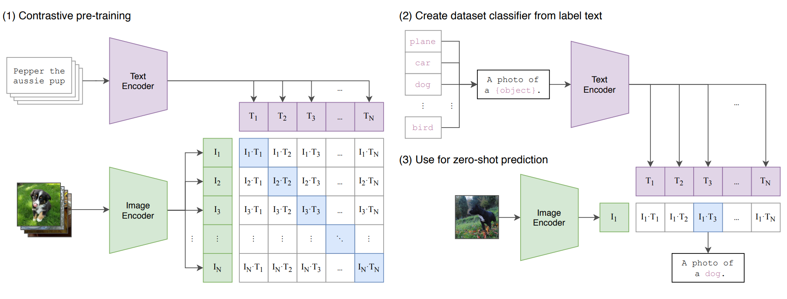

# Contrastive Language-Image Pre-Training

<!-- omit in toc -->

文章链接：[Learning Transferable Visual Models From Natural Language Supervision](https://arxiv.org/abs/2103.00020)
代码链接：[CLIP](https://github.com/openai/CLIP)

## 模型

模型思路：对比预训练，训练样本是配对的图像-文字，采用一个Text Encoder和Image Encoder分别进行编码，处于对角线区域的就是正样本对，其余的就是负样本对。这样子就通过对比学习的思路获得了一个文本编码器和图像编码器；

Zero Shot，比如将CLIP用于分类任务上，将类别先扩充成句子，采用Text Encoder对句子进行编码；采用训练好的Image Encoder对图片进行编码，之后将图像特征和文本特征进行一个相似度衡量。这样子就可以摆脱需要提前定义基础类的限制。

数据集：4亿个图像文本对；

