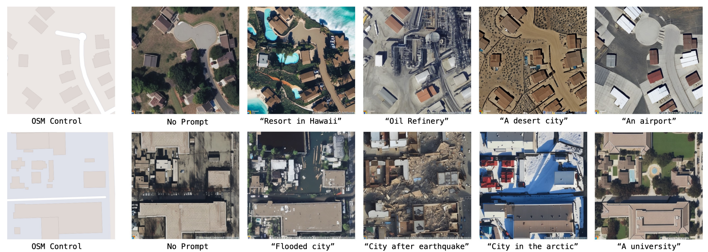
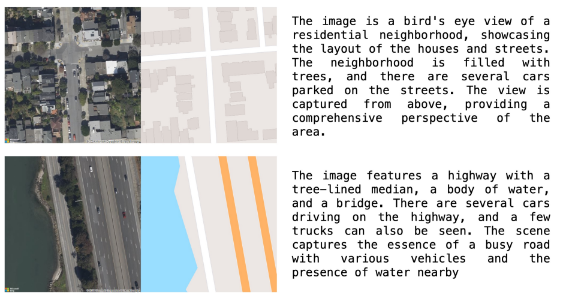
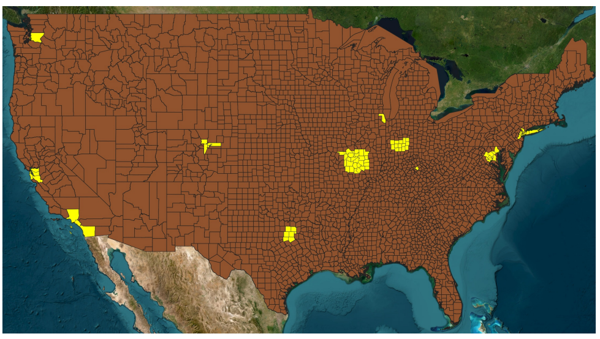
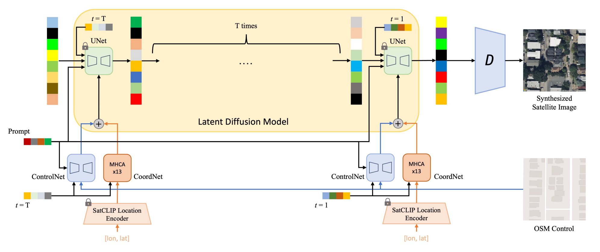

# GeoSynth: Contextually-Aware High-Resolution Satellite Image Synthesis
<!-- omit in toc -->

文章链接：[GeoSynth: Contextually-Aware High-Resolution Satellite Image Synthesis](https://arxiv.org/pdf/2404.06637)
代码链接：[GeoSynth](https://github.com/mvrl/GeoSynth?tab=readme-ov-file)

## 效果



## 目的

实现遥感影像生成；

## 贡献点

* 使用ControlNet和SatCLIP提取特征用于高分辨率卫星影像合成；
* 在三种条件控制的情况下进行了测试：OSM图像、Canny边缘图像和SAM掩码；
* 展示了优秀的零样本能力；

## 数据集

成对的高分辨率卫星影像、OSM影像、文本描述、SAM掩码。



数据来源于10个美国的主要城市，为了提高覆盖率并减小空间误差，每个采样位置彼此间隔至少1公里。所有下载的图像大小为512×512像素，地面采样距离为0.6m。下载了90,305个图像对，并过滤了完全由裸露的土地、水、或森林组成的图像对。经过筛选之后，数据集共包含44,848个图像对。使用LLaVA对每一张卫星影像进行描述，prompt是“Describe the contents of the image”，在两张A6000卡上花费了40个GPU时。最后，对每一张卫星影像生成对应的Canny边缘图像和SAM掩码图像。



## 模型

旨在获取具有以下能力的一套模型：在给定文本提示、地理位置、控制图像的情况下合成卫星图像。使用一个预训练的Latent Diffusion Models(LDM)，由4个主要的架构组件组成。1）encoder将图像转换至低维潜在空间；2）预训练的CLIP文本编码器处理文本提示并生成潜在文本向量；3）U-Net架构的扩散模型集成交叉注意力模块；4）decoder根据对应的潜在向量重建图像。



如图中所示，使用ControlNet将控制图片集成至预训练的LDM中。为了将地理位置作为一个条件集成到网络中，使用了SatCLIP提取基于位置的特征，并设计了CoordNet基于交叉注意力机制的Transformer。以SatCLIP基于位置的embeddings和diffusion的timestep作为输入。

## 代码

直接使用文本生成图像：

```python
from diffusers import StableDiffusionPipeline

pipe = StableDiffusionPipeline.from_pretrained(r"./GeoSynth")
pipe = pipe.to("cuda:0")

image = pipe(
    "Satellite image, urban area, with two roads in the middle and a lake on the right",
).images[0]

image.save("geosynth_generated_city.jpg")
```

基于OSM、SAM、Canny分别生成图像：

```python
from diffusers import StableDiffusionControlNetPipeline, ControlNetModel
import torch
from PIL import Image

img = Image.open(r"./sam_tile_18_66995_97188.jpeg")

controlnet = ControlNetModel.from_pretrained(r"./GeoSynth-SAM")

pipe = StableDiffusionControlNetPipeline.from_pretrained(r"./stable-diffusion-2-1-base", controlnet=controlnet)
pipe = pipe.to("cuda:0")

# generate image
generator = torch.manual_seed(10345340)
image = pipe(
    "Satellite image features a city neighborhood",
    generator=generator,
    image=img,
).images[0]

image.save("generated_city_sam.jpg")
```

## 遇见问题

```sh
module ‘torch‘ has no attribute ‘float8_e4m3fnuz‘
```

更改torch至2.3.1版本即可；
