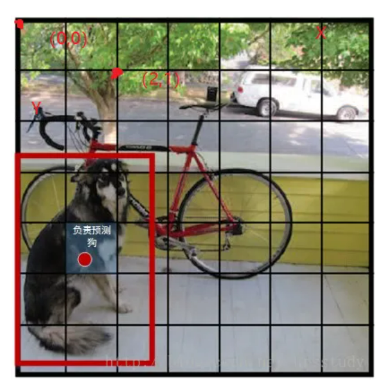
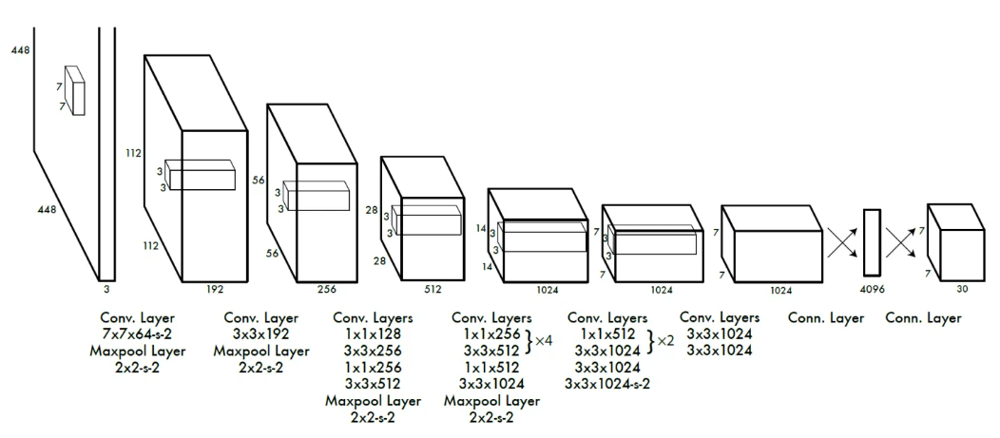
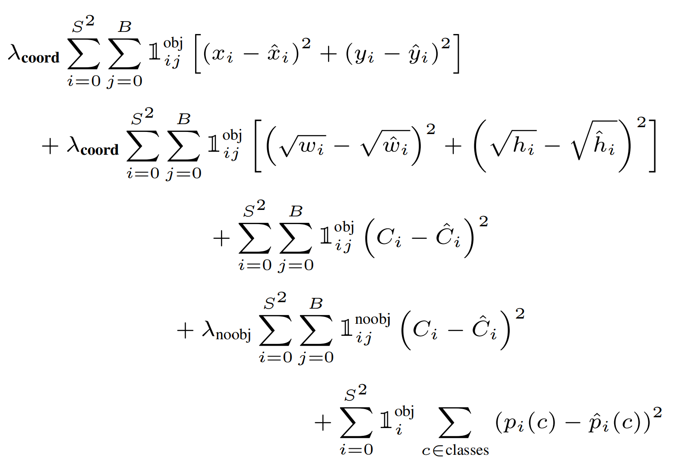

# YOLO笔记

目标检测模型分为两类，Region-free（单阶段方法）， Region-based（两阶段方法）

目标检测的目的是在一张图片中找出物体，并给出它的类别和位置。目标检测每张图片的标注信息是所包含的N个实例框，每个框都有标注信息，中心位置、高和宽，以及类别。

## 两阶段方法

当图片中有多个类别时，需要将每一个类型都识别出来。那么在正常的识别过程中，会遇到的问题有：1）物体位置不确定，物体可能位于图像边缘，可能位于图像中间；2）物体大小不确定，物体可能在图像中占据大部分区域，也可能仅仅只有几个像素；3）物体种类不确定，一张图像中可能出现多个物体种类；

最原始的方法就是采用滑动窗口一个个地识别物体。如果一个物体正好出现在一个滑窗中，那么就将这个滑窗位置认为是这个物体所在的位置。滑窗每次滑动的距离是步长。为了保证每个物体都在一个滑窗中，可以将步长设置很小。同时，考虑到有不同大小的物体，滑窗也可以设置成不同大小。因此，这种方法在识别过程中，会设计不同大小的窗口，按照最小步长滑动，将窗口中的所有图片都放入分类器中。但是会花费大量时间。而R-CNN则会提前生成一系列窗口，就会节省大量时间。

## YOLO

YOLOv1于2015年提出；

YOLO系列与两阶段算法不同，两阶段算法是优先算好哪些地方会出现物体，然后对这些框进行排除；而YOLO是直接对整张图像提取物体信息。

YOLO的第一步是分割图片，将图片分割成$s^2$个格子，每个格子的大小都是相等的。如果这些框每一个只能识别一个物体，并且要求物体必须落在这个框之内，那么就和以前的滑窗法没有任何区别了。但是YOLO认为只要求物体的中心落在这个框之中就好了。

对于每个框都预测B个bounding box，其中有5个值，中心位置（x，y）、h、w，以及这次预测的置信度c，每个框还需要有一个类别，假设有C个类别，用one-hot编码表示，因此整张图的ground truth长度为：$S \times S \times (B \times 5 + C)$

YOLO的CNN网络将图片分割成$s^2$个格子，每个单元格负责去检测哪些中心点落在该格子内的目标。如图所示，狗这个目标的中心落在这个单元格内，那么这个单元格就负责预测这个狗。每个边界框的置信度包含两个方面，一是这个边界框含有目标的可能性大小 $Pr(object) $，当该边界框是背景时，即不含目标，此时该值为0，当该边界框包含目标时，该值为1，二是这个边界框的准确度。边界框的准确度用预测框与实际框的IOU特征来表示，记为$ IOU_{pred}^{truth}$,因此置信度表示为$ Pr(object)*IOU_{pred}^{truth}$。边界框的大小与位置可以用4个值来表示：$(x,y,w,h)$，每个边界框的预测值实际上包含5个元素：$(x,y,w,h,c)$，其中前4个表示边界框的大小与位置，而最后一个值是置信度。对于每一个单元格，还需要给出C个类别概率值，表示的是由该单元格负责预测的边界框其目标属于各个类别的概率。这些概率值是在各个边界框置信度下的条件概率，即$ Pr(class_i|object)$，但是这种方法，不管一个单元格中预测多少个边界框，只能预测一组类别概率值，这意味着一个格子只能负责一个目标的预测。

以PASCAL VOC数据为例，其中共有20个类别，如果使用$S=7, B=2$，那么最终的预测结果就是$7 \times 7 \times 30$大小的张量，30的计算是5乘以2加上20，因为最后的类别是用one-hot编码表示的，所以需要加上20。

YOLO采用卷积神经网络来提取特征，最后网络输出$7 \times 7 \times 30$大小的张量，其张量所代表的含义是，对每一个单元格，前20个值是类别概率值，然后2个是边界框置信度，最后8个是边界框的(x,y,w,h)。

最后是需要了解一下所使用的训练损失函数。该损失函数由两部分组成，定位误差和分类误差。定位误差是边界框坐标预测误差，采用较大的权重$\lambda_{coord}=5$，定位误差中区分不包含目标的边界框与含有目标的边界框的置信度。对于不包含目标的边界框，采用较小的权重值$\lambda_{noobj}=0.5$，其余权重均设为1。由于较小边界框的坐标误差应该要比较大边界框更敏感，因此将网络的边界框的宽高预测改为对其平方根的预测。由于每个单元格预测多个边界框，但是其对应类别只有一个，那么在训练时，该单元格内存在目标的话，只选择与ground truth IOU最大的那个边界框负责预测该目标，而其他边界框认为不存在目标。这样可以保证一个单元格对应的边界框更加专业化，其可以适用于不同大小、不同高宽比的目标，从而提升模型性能。但是缺点在于如果一个单元格内确实存在多个目标的话，YOLO就只能选择其中一个来进行训练。

损失函数第一项，边界框中心坐标的误差项，对每一个单元格中的每一个边界框，有目标的就计算中心坐标误差损失；
第二项，边界框高宽的误差项；
第三项，对包含目标的边界框的置信度误差项；
第四项，不包含目标的边界框的置信度误差项；
第五项，包含目标的单元格的分类误差；

非极大值抑制算法（non maximum suppression, NMS），用于解决一个目标被多次预测的问题，就是一个目标出现了多个框的问题。从所有检测框中找到置信度最大的框，然后挨个计算其与剩余框的IOU，如果IOU大于一定阈值，就将该框剔除；反复该过程，直至处理完所有的检测框。

优点：比二阶段方法快；
缺点：每一个网格仅预测两个框，并且每个网格的预测类别有限，不适合物体密集情况；

## YOLO-v2

同一作者针对V1存在的问题，于2017年进行了修改，包括：更改骨干网络；引入PassThrough；借鉴二阶段方法的思想添加预选框；

骨干网络换成了Darknet-19，有1000个类别；passthrough其实就和跳跃连接差不多；Fast RCNN和RCNN都是使用selective search搜选预选框的，而Faster RCNN中提出了RPN的网络，因此YOLOv2结合了RPN网络，对特征图生成anchor boxes；

## YOLO-v3

同一作者于2018年提出了YOLOv3结构，主要改进是引入了残差结构，并借助特征金字塔FPN的思路，在三个不同的尺寸上分别进行预测；

## YOLO-v4

2020年，其余团队在YOLOv3的基础上进行大量修改和改进之后提出了YOLOv4结构；改进其实是用了很多的策略；

## YOLO-v5

