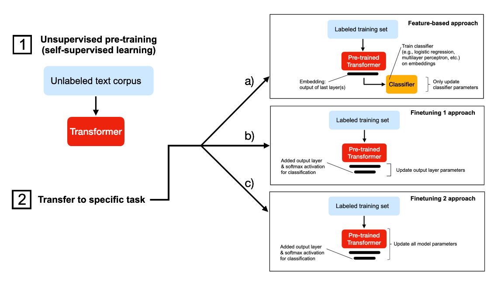
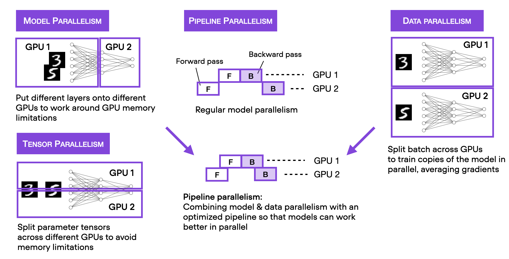
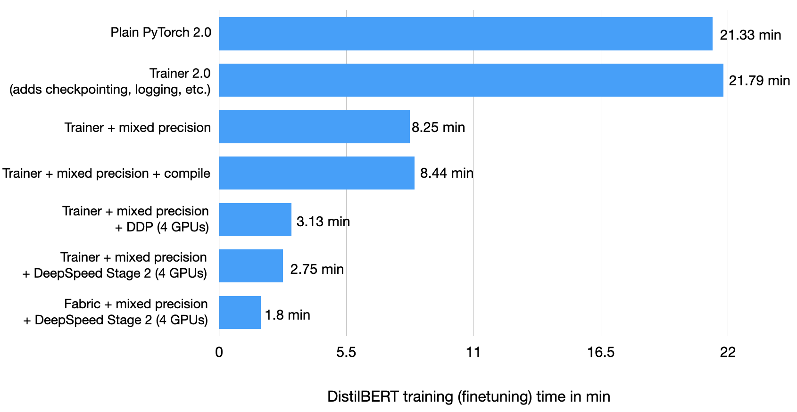

# 深度学习模型训练加速

## 简介

以DistilBERT为例，进行微调。DistilBERT是BERT的一种蒸馏版本，但是要小40%。一般有几种方式去微调一个预训练语言模型。



a) 提取embeddings，训练一个分类器，可以是支持向量机；
b) 取消或者增加一个输出层，微调最后一层；
c) 取消或者增加一个输出层，微调所有层；

从a到c三种方式，计算量逐渐增大，a是计算最快的，c方法经常会有最高的精度。

## Pytorch训练流程

```python
def train(num_epochs, model, optimizer, train_loader, val_loader, device):
    for epoch in range(num_epochs):
        train_acc = torchmetrics.Accuracy(task="multiclass", num_classes=2).to(device)

        for batch_idx, batch in enumerate(train_loader):
            model.train()
            for s in ["input_ids", "attention_mask", "label"]:
                batch[s] = batch[s].to(device)

            ### FORWARD AND BACK PROP
            outputs = model(
                batch["input_ids"],
                attention_mask=batch["attention_mask"],
                labels=batch["label"],
            )
            optimizer.zero_grad()
            outputs["loss"].backward()

            ### UPDATE MODEL PARAMETERS
            optimizer.step()

            ### LOGGING
            if not batch_idx % 300:
                print(
                    f"Epoch: {epoch+1:04d}/{num_epochs:04d} | Batch {batch_idx:04d}/{len(train_loader):04d} | Loss: {outputs['loss']:.4f}"
                )

            model.eval()
            with torch.no_grad():
                predicted_labels = torch.argmax(outputs["logits"], 1)
                train_acc.update(predicted_labels, batch["label"])

        ### MORE LOGGING
        with torch.no_grad():
            model.eval()
            val_acc = torchmetrics.Accuracy(task="multiclass", num_classes=2).to(device)
            for batch in val_loader:
                for s in ["input_ids", "attention_mask", "label"]:
                    batch[s] = batch[s].to(device)
                outputs = model(
                    batch["input_ids"],
                    attention_mask=batch["attention_mask"],
                    labels=batch["label"],
                )
                predicted_labels = torch.argmax(outputs["logits"], 1)
                val_acc.update(predicted_labels, batch["label"])

            print(
                f"Epoch: {epoch+1:04d}/{num_epochs:04d} | Train acc.: {train_acc.compute()*100:.2f}% | Val acc.: {val_acc.compute()*100:.2f}%"
            )
```
定义一个训练流程：
1）前向传播，梯度回传；
2）更新模型参数；
3）打印日志；
4）一个epoch之后验证一次；

```python
##########################
    ### 1 Loading the Dataset
    ##########################
    download_dataset()
    df = load_dataset_into_to_dataframe()
    if not (op.exists("train.csv") and op.exists("val.csv") and op.exists("test.csv")):
        partition_dataset(df)

    imdb_dataset = load_dataset(
        "csv",
        data_files={
            "train": "train.csv",
            "validation": "val.csv",
            "test": "test.csv",
        },
    )

    #########################################
    ### 2 Tokenization and Numericalization
    #########################################

    tokenizer = AutoTokenizer.from_pretrained("distilbert-base-uncased")
    print("Tokenizer input max length:", tokenizer.model_max_length, flush=True)
    print("Tokenizer vocabulary size:", tokenizer.vocab_size, flush=True)

    print("Tokenizing ...", flush=True)
    imdb_tokenized = imdb_dataset.map(tokenize_text, batched=True, batch_size=None)
    del imdb_dataset
    imdb_tokenized.set_format("torch", columns=["input_ids", "attention_mask", "label"])
    os.environ["TOKENIZERS_PARALLELISM"] = "false"

    #########################################
    ### 3 Set Up DataLoaders
    #########################################

    train_dataset = IMDBDataset(imdb_tokenized, partition_key="train")
    val_dataset = IMDBDataset(imdb_tokenized, partition_key="validation")
    test_dataset = IMDBDataset(imdb_tokenized, partition_key="test")

    train_loader = DataLoader(
        dataset=train_dataset,
        batch_size=12,
        shuffle=True,
        num_workers=1,
        drop_last=True,
    )

    val_loader = DataLoader(
        dataset=val_dataset,
        batch_size=12,
        num_workers=1,
        drop_last=True,
    )

    test_loader = DataLoader(
        dataset=test_dataset,
        batch_size=12,
        num_workers=1,
        drop_last=True,
    )

    #########################################
    ### 4 Initializing the Model
    #########################################

    model = AutoModelForSequenceClassification.from_pretrained(
        "distilbert-base-uncased", num_labels=2
    )

    model.to(device)
    optimizer = torch.optim.Adam(model.parameters(), lr=5e-5)

    #########################################
    ### 5 Finetuning
    #########################################

    start = time.time()
    train(
        num_epochs=3,
        model=model,
        optimizer=optimizer,
        train_loader=train_loader,
        val_loader=val_loader,
        device=device,
    )

    end = time.time()
    elapsed = end - start
    print(f"Time elapsed {elapsed/60:.2f} min")

    with torch.no_grad():
        model.eval()
        test_acc = torchmetrics.Accuracy(task="multiclass", num_classes=2).to(device)
        for batch in test_loader:
            for s in ["input_ids", "attention_mask", "label"]:
                batch[s] = batch[s].to(device)
            outputs = model(
                batch["input_ids"],
                attention_mask=batch["attention_mask"],
                labels=batch["label"],
            )
            predicted_labels = torch.argmax(outputs["logits"], 1)
            test_acc.update(predicted_labels, batch["label"])

    print(f"Test accuracy {test_acc.compute()*100:.2f}%")
```

整个训练流程：
1）加载数据集；
2）初始化模型；
3）微调；

## PytorchLightning训练流程

将PyTorch模型包装在LightningModule，使用Lightning中的Trainer类。使用的是lightning库

```python
class LightningModel(L.LightningModule):
    def __init__(self, model, learning_rate=5e-5):
        super().__init__()

        self.learning_rate = learning_rate
        self.model = model

        self.train_acc = torchmetrics.Accuracy(task="multiclass", num_classes=2)
        self.val_acc = torchmetrics.Accuracy(task="multiclass", num_classes=2)
        self.test_acc = torchmetrics.Accuracy(task="multiclass", num_classes=2)

    def forward(self, input_ids, attention_mask, labels):
        return self.model(input_ids, attention_mask=attention_mask, labels=labels)

    def training_step(self, batch, batch_idx):
        outputs = self(
            batch["input_ids"],
            attention_mask=batch["attention_mask"],
            labels=batch["label"],
        )
        self.log("train_loss", outputs["loss"])
        with torch.no_grad():
            logits = outputs["logits"]
            predicted_labels = torch.argmax(logits, 1)
            self.train_acc(predicted_labels, batch["label"])
            self.log("train_acc", self.train_acc, on_epoch=True, on_step=False)
        return outputs["loss"]  # this is passed to the optimizer for training

    def validation_step(self, batch, batch_idx):
        outputs = self(
            batch["input_ids"],
            attention_mask=batch["attention_mask"],
            labels=batch["label"],
        )
        self.log("val_loss", outputs["loss"], prog_bar=True)

        logits = outputs["logits"]
        predicted_labels = torch.argmax(logits, 1)
        self.val_acc(predicted_labels, batch["label"])
        self.log("val_acc", self.val_acc, prog_bar=True)

    def test_step(self, batch, batch_idx):
        outputs = self(
            batch["input_ids"],
            attention_mask=batch["attention_mask"],
            labels=batch["label"],
        )

        logits = outputs["logits"]
        predicted_labels = torch.argmax(logits, 1)
        self.test_acc(predicted_labels, batch["label"])
        self.log("accuracy", self.test_acc, prog_bar=True)

    def configure_optimizers(self):
        optimizer = torch.optim.Adam(
            self.trainer.model.parameters(), lr=self.learning_rate
        )
        return optimizer
```

train_step函数对每一个batch里的数据进行计算，完成一个forward过程，计算精度输出，返回损失值；
validation_step函数在验证过程中对验证集的每一个batch里的数据进行计算，仅为验证模型在验证集上的精度使用，不返回任何损失；
test_step函数测试模型在测试集上的精度；

其余的训练参数设置在Trainer类中设置，然后调用fit函数自动训练；

这种训练方式训练时间并没有提升；

## Automatic Mixed Precision Training

条件是GPU得支持混合精度训练，使用混合精度训练方式，训练期间在32位和16位浮点表示之间切换而不牺牲精度。

实现方式仅仅需要添加一行代码：

```python
trainer = L.Trainer(
        max_epochs=3,
        callbacks=callbacks,
        accelerator="gpu",
        precision="16",  # <-- NEW
        devices=[1],
        logger=logger,
        log_every_n_steps=10,
        deterministic=True,
    )
```

这种方式的训练，能够提升3倍训练速度。

## Static Graphs with Torch.Compile

torch.compile是PyTorch2.0以上的一个特性，能够通过生成优化后的图加速PyTorch代码，而不是在以往的动态图上。

```python
# ...
model = AutoModelForSequenceClassification.from_pretrained(
        "distilbert-base-uncased", num_labels=2
    )

model = torch.compile(model) # NEW
lightning_model = LightningModel(model)
# ...
```

在Lightning上的加速效果不是很明显；

```python
  model.to(torch.device("cuda:0"))
  model = torch.compile(model)

  for batch_idx, batch in enumerate(train_loader):
      model.train()
      for s in ["input_ids", "attention_mask", "label"]:
          batch[s] = batch[s].to(torch.device("cuda:0"))
      break

  outputs = model(
      batch["input_ids"],
      attention_mask=batch["attention_mask"],
      labels=batch["label"],
  )

  lightning_model = LightningModel(model)
  # start timing and training below
```

## Training on 4 GPUs with Distributed Data Parallel

多GPU并行包含多种方式，最简单的是数据并行DistributedDataParallel。



```python
    trainer = L.Trainer(
        max_epochs=3,
        callbacks=callbacks,
        accelerator="gpu",
        devices=4,  # <-- NEW
        strategy="ddp",  # <-- NEW
        precision="16",
        logger=logger,
        log_every_n_steps=10,
        deterministic=True,
    )
```

## DeepSpeed

```sh
pip install -U deepspeed
```

使用哪种策略很大程度上取决于GPU的型号、数量和内存大小。例如，当预训练模型不适合单个GPU的大型模型时，最好从简单的"ddp_sharded"策略开始，该策略为ddp添加了张量并行。

另外，更复杂的"deepspeed_stage_2"策略，将优化器状态和梯度分片，如果这种情况下不足以将模型放入GPU内存中，"deepspeed_stage_2_offload"变体将优化器和梯度状态卸载到CPU内存中（以性能为代价）。

stage_3策略对优化器、梯度、参数等所有参数都进行分片

* strategy="deepspeed_stage_3"
* strategy="deepspeed_stage_3_offload"

```python
    trainer = L.Trainer(
        max_epochs=3,
        callbacks=callbacks,
        accelerator="gpu",
        devices=4,
        strategy="deepspeed_stage_2",  # <-- NEW
        precision="16",
        logger=logger,
        log_every_n_steps=10,
        deterministic=True,
    )
```

PyTorch也有DeepSpeed替代方案，fully-sharded DataParallel，调用方式是strategy="fsdp"

## Fabric

Fabric本质是一种扩展PyTorch代码的替代方法，下面的代码是在Lightning代码的基础上修改为Fabric的，代码前面的-表示这一行删除了，+表示是新增的。

```python
import os
import os.path as op
import time

+ from lightning import Fabric

from datasets import load_dataset
import matplotlib.pyplot as plt
import pandas as pd
import torch
from torch.utils.data import DataLoader
import torchmetrics
from transformers import AutoTokenizer
from transformers import AutoModelForSequenceClassification
from watermark import watermark

from local_dataset_utilities import download_dataset, load_dataset_into_to_dataframe, partition_dataset
from local_dataset_utilities import IMDBDataset


def tokenize_text(batch):
    return tokenizer(batch["text"], truncation=True, padding=True)


def plot_logs(log_dir):
    metrics = pd.read_csv(op.join(log_dir, "metrics.csv"))

    aggreg_metrics = []
    agg_col = "epoch"
    for i, dfg in metrics.groupby(agg_col):
        agg = dict(dfg.mean())
        agg[agg_col] = i
        aggreg_metrics.append(agg)

    df_metrics = pd.DataFrame(aggreg_metrics)
    df_metrics[["train_loss", "val_loss"]].plot(
        grid=True, legend=True, xlabel="Epoch", ylabel="Loss"
    )
    plt.savefig(op.join(log_dir, "loss.pdf"))

    df_metrics[["train_acc", "val_acc"]].plot(
        grid=True, legend=True, xlabel="Epoch", ylabel="Accuracy"
    )
    plt.savefig(op.join(log_dir, "acc.pdf"))


- def train(num_epochs, model, optimizer, train_loader, val_loader, device):
+ def train(num_epochs, model, optimizer, train_loader, val_loader, fabric):

      for epoch in range(num_epochs):
-         train_acc = torchmetrics.Accuracy(task="multiclass", num_classes=2).to(device)
+         train_acc = torchmetrics.Accuracy(task="multiclass", num_classes=2).to(fabric.device)

        model.train()
        for batch_idx, batch in enumerate(train_loader):

-             for s in ["input_ids", "attention_mask", "label"]:
-                 batch[s] = batch[s].to(device)

            outputs = model(batch["input_ids"], attention_mask=batch["attention_mask"], labels=batch["label"]) 
            optimizer.zero_grad()
-            outputs["loss"].backward()
+            fabric.backward(outputs["loss"])

            ### UPDATE MODEL PARAMETERS
            optimizer.step()

            ### LOGGING
            if not batch_idx % 300:
                print(f"Epoch: {epoch+1:04d}/{num_epochs:04d} | Batch {batch_idx:04d}/{len(train_loader):04d} | Loss: {outputs['loss']:.4f}")

            model.eval()
            with torch.no_grad():
                predicted_labels = torch.argmax(outputs["logits"], 1)
                train_acc.update(predicted_labels, batch["label"])

        ### MORE LOGGING
        model.eval()
        with torch.no_grad():
-            val_acc = torchmetrics.Accuracy(task="multiclass", num_classes=2).to(device)
+            val_acc = torchmetrics.Accuracy(task="multiclass", num_classes=2).to(fabric.device)
            for batch in val_loader:
-                for s in ["input_ids", "attention_mask", "label"]:
-                    batch[s] = batch[s].to(device)
                outputs = model(batch["input_ids"], attention_mask=batch["attention_mask"], labels=batch["label"])
                predicted_labels = torch.argmax(outputs["logits"], 1)
                val_acc.update(predicted_labels, batch["label"])

            print(f"Epoch: {epoch+1:04d}/{num_epochs:04d} | Train acc.: {train_acc.compute()*100:.2f}% | Val acc.: {val_acc.compute()*100:.2f}%")
            train_acc.reset(), val_acc.reset()


if __name__ == "__main__":

    print(watermark(packages="torch,lightning,transformers", python=True))
    print("Torch CUDA available?", torch.cuda.is_available())    
-   device = "cuda" if torch.cuda.is_available() else "cpu"
    torch.manual_seed(123)

    ##########################
    ### 1 Loading the Dataset
    ##########################
    download_dataset()
    df = load_dataset_into_to_dataframe()
    if not (op.exists("train.csv") and op.exists("val.csv") and op.exists("test.csv")):
        partition_dataset(df)

    imdb_dataset = load_dataset(
        "csv",
        data_files={
            "train": "train.csv",
            "validation": "val.csv",
            "test": "test.csv",
        },
    )

    #########################################
    ### 2 Tokenization and Numericalization
    #########################################

    tokenizer = AutoTokenizer.from_pretrained("distilbert-base-uncased")
    print("Tokenizer input max length:", tokenizer.model_max_length, flush=True)
    print("Tokenizer vocabulary size:", tokenizer.vocab_size, flush=True)

    print("Tokenizing ...", flush=True)
    imdb_tokenized = imdb_dataset.map(tokenize_text, batched=True, batch_size=None)
    del imdb_dataset
    imdb_tokenized.set_format("torch", columns=["input_ids", "attention_mask", "label"])
    os.environ["TOKENIZERS_PARALLELISM"] = "false"

    #########################################
    ### 3 Set Up DataLoaders
    #########################################

    train_dataset = IMDBDataset(imdb_tokenized, partition_key="train")
    val_dataset = IMDBDataset(imdb_tokenized, partition_key="validation")
    test_dataset = IMDBDataset(imdb_tokenized, partition_key="test")

    train_loader = DataLoader(
        dataset=train_dataset,
        batch_size=12,
        shuffle=True, 
        num_workers=2,
        drop_last=True,
    )

    val_loader = DataLoader(
        dataset=val_dataset,
        batch_size=12,
        num_workers=2,
        drop_last=True,
    )

    test_loader = DataLoader(
        dataset=test_dataset,
        batch_size=12,
        num_workers=2,
        drop_last=True,
    )


    #########################################
    ### 4 Initializing the Model
    #########################################

+    fabric = Fabric(accelerator="cuda", devices=4, 
+                    strategy="deepspeed_stage_2", precision="16-mixed")
+    fabric.launch()

    model = AutoModelForSequenceClassification.from_pretrained(
        "distilbert-base-uncased", num_labels=2)

-   model.to(device)
    optimizer = torch.optim.Adam(model.parameters(), lr=5e-5)

+    model, optimizer = fabric.setup(model, optimizer)
+    train_loader, val_loader, test_loader = fabric.setup_dataloaders(
+        train_loader, val_loader, test_loader)

    #########################################
    ### 5 Finetuning
    #########################################

    start = time.time()
    train(
        num_epochs=3,
        model=model,
        optimizer=optimizer,
        train_loader=train_loader,
        val_loader=val_loader,
-       device=device
+       fabric=fabric
    )

    end = time.time()
    elapsed = end-start
    print(f"Time elapsed {elapsed/60:.2f} min")

    with torch.no_grad():
        model.eval()
-       test_acc = torchmetrics.Accuracy(task="multiclass", num_classes=2).to(device)
+       test_acc = torchmetrics.Accuracy(task="multiclass", num_classes=2).to(fabric.device)
        for batch in test_loader:
-           for s in ["input_ids", "attention_mask", "label"]:
-               batch[s] = batch[s].to(device)
            outputs = model(batch["input_ids"], attention_mask=batch["attention_mask"], labels=batch["label"])
            predicted_labels = torch.argmax(outputs["logits"], 1)
            test_acc.update(predicted_labels, batch["label"])

    print(f"Test accuracy {test_acc.compute()*100:.2f}%")
```


___

参考链接：[让Pytorch训练更快](https://sebastianraschka.com/blog/2023/pytorch-faster.html)
