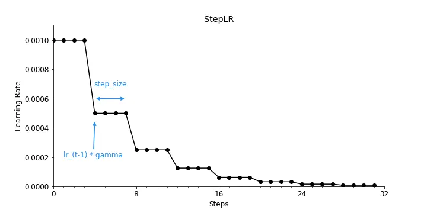
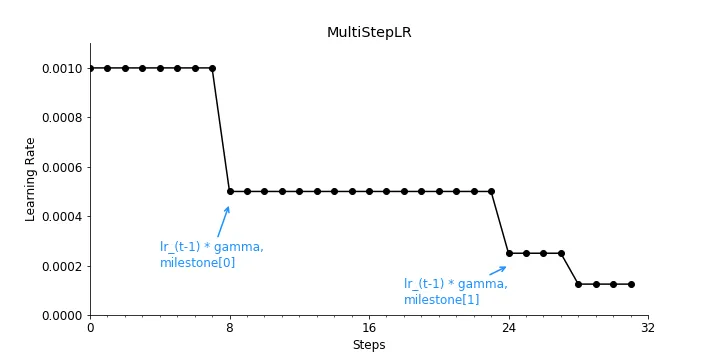
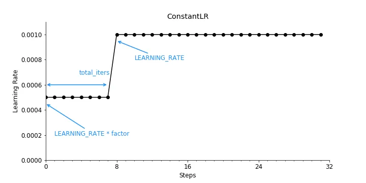

# 学习率

## 超参数学习率

学习率是深度学习中常用的一个超参数，决定了模型在训练过程中权重的变化过程。但是，选择正确的学习率值是很有挑战性的。一方面，一个大学习率能够帮助算法快速收敛，但是也会引起算法在最小值附近反弹而到达不了最小值，甚至可能会跳过最小值。另一方面，一个小学习率能够更好地收敛至最小值，但是优化器可能会花费更多时间才能收敛或者陷入一个停滞状态。

## 学习率调整策略

为了解决学习率设置过大过小的问题，帮助算法快速收敛至最小值的一个有效策略是使用学习率调度器。一般来说，学习率在训练的初始过程中设置一个较大值以达到快速收敛的目的。在训练过程中学习率不断减小，保证收敛至最小值以获得更好的性能。

StepLR

```python
from torch.optim.lr_scheduler import StepLR

scheduler = StepLR(optimizer, 
                   step_size = 4, # Period of learning rate decay
                   gamma = 0.5) # Multiplicative factor of learning rate decay
```



MultiStepLR

```python
from torch.optim.lr_scheduler import MultiStepLR

scheduler = MultiStepLR(optimizer, 
                        milestones=[8, 24, 28], # List of epoch indices
                        gamma =0.5) # Multiplicative factor of learning rate decay
```



ConstantLR

```python
from torch.optim.lr_scheduler import ConstantLR

scheduler = ConstantLR(optimizer, 
                       factor = 0.5, # The number we multiply learning rate until the milestone.
                       total_iters = 8) # The number of steps that the scheduler decays the learning rate
```



在ConstantLR策略中，当factor小于1时，该策略将会增大学习率而不是减小；

LinearLR

```python
from torch.optim.lr_scheduler import LinearLR

scheduler = LinearLR(optimizer, 
                     start_factor = 0.5, # The number we multiply learning rate in the first epoch
                     total_iters = 8) # The number of iterations that multiplicative factor reaches to 1
```


ExponentialLR

指数学习率在每一个training step中通过一个乘法倍数减小学习率。

```python
from torch.optim.lr_scheduler import ExponentialLR

scheduler = ExponentialLR(optimizer, 
                          gamma = 0.5) # Multiplicative factor of learning rate decay.
```

PolynomialLR

通过一个预定义的多项式减小学习率。

```python
from torch.optim.lr_scheduler import PolynomialLR

scheduler = PolynomialLR(optimizer, 
                         total_iters = 8, # The number of steps that the scheduler decays the learning rate.
                         power = 1) # The power of the polynomial.
```

CosineAnnealingLR

以余弦函数的方式减小学习率。从技术上讲，这个学习率调整是任意的，但是，其想法是在最大迭代次数的半个周期内衰减学习率。

```python
from torch.optim.lr_scheduler import CosineAnnealingLR

scheduler = CosineAnnealingLR(optimizer,
                              T_max = 32, # Maximum number of iterations.
                             eta_min = 1e-4) # Minimum learning rate.
```

CosineAnnealingWarnRestartsLR

与CosineAnnealingLR类似，但是CosineAnnealingWarnRestartsLR能够对每个epoch以预定义的学习率进行重启。

```python
from torch.optim.lr_scheduler import CosineAnnealingWarmRestarts
scheduler = CosineAnnealingWarmRestarts(optimizer, 
                                        T_0 = 8,# Number of iterations for the first restart
                                        T_mult = 1, # A factor increases TiTi​ after a restart
                                        eta_min = 1e-4) # Minimum learning rate
```

CyclicLR


https://towardsdatascience.com/a-visual-guide-to-learning-rate-schedulers-in-pytorch-24bbb262c863
