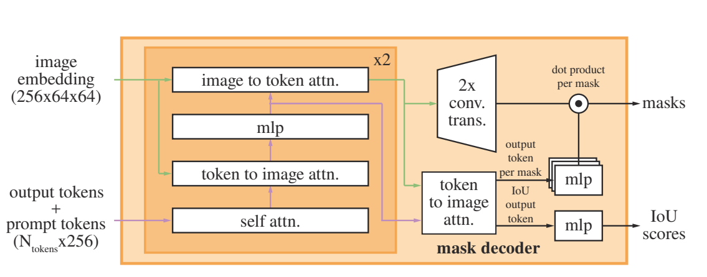

# SAM

## SAM是什么

SAM(Segment Anything)，能够根据提示语实现目标检测和图像分割。

零样本任务：
通过提示输入，生成有效mask。提示可以是点，矩形框，文字，mask或者是图像；

## 网络

模型结构：
模型需要支持灵活的提示，且根据不同的提示实时生成mask。模型输出也是模糊的，不表示对象的具体语义信息，例如这是衣服，这是桌子，这是人，而是仅仅只表示这是一个对象。

模型包括一个prompt encoder，对提示进行编码，image encoder对图像进行编码，生成图像的embedding表示，最后融合两个encoder，接一个轻量的mask decoder，输出最后的mask结果。

image encoder

利用mae预训练的vit，对每张图像运行一次。图像输入大小(c, h, w)，对图像进行缩放成1024，得到(c, 1024, 1024)的图像，再经过image encoder，得到对图像16倍下采样的特征图，大小为(256, 64, 64)

prompt encoder

提示编码器包括两类，稀疏

稀疏提示被映射到256维矢量嵌入表示，一个点包含点的位置，以及指示该点是在前景中还是背景中；一个框则用嵌入对表示，一个可学习的embedding代表左上角，另一个可学习的embedding代表右下角；文本，则通过CLIP模型进行文本编码；

稠密提示例如masks，与原图有空间联系；用输入图像1/4分辨率大小的mask，最终维度升为256。mask和image embedding通过element-wise逐元素相乘，相当于采用mask的特征图对image的feature进行加权。如果没有mask prompt的话，就会学习一个代表no mask的embedding。

mask decoder

该模块旨在将一组prompt embeddings和image embedding映射为输出掩码。首先在prompt embedding中插入一组可学习的token，为了方便，将除了image embedding之外的所有embeddings称为token。decoder层包含4个步骤：
1）prompt tokens，output tokens做 self attn；
2）1）得到的tokens做查询，和image embedding做cross attn；
3）point-wise MLP更新tokens；
4）用image embedding作查询，和tokens做cross attn；

为了保证模型具有模糊性意识，因为有时候，一个prompt，例如一个点，它很有可能处于多个mask中。为了缓解这个问题，相比于直接预测一个mask，采用同时预测多个mask的方法。默认是预测三个mask，whole，part，subpart。训练过程中计算三个mask的损失，但是在梯度回传的时候只回传损失值最小的那个。在应用中，添加了一个head用于评估预测的mask和真值之间的IoU。当有多个prompt时，这种模糊现象就会很少，比如说两个点，多个框之类的，这种情况下预测的多个掩码结果就会很接近，为了最大限度减小损失函数，并且确保单个mask能够正确地进行梯度回传，因此当有多个prompt提供时，仅仅只预测一个mask，在代码中实现方式是添加一个output token用于额外的掩码预测，当只有一个prompt时，这个掩码永远不会返回值；当有多个prompt时，仅返回一个掩码。

## 数据

数据总图片数：11M；
数据掩膜数目：1.1B；
平均一张图片上的标书数目：100；
平均图片分辨率：1500 x 2250 pixels

## 训练策略

mask损失函数：20：1的focal loss：dice loss
IoU预测头：mse loss

训练过程中，prompt产生的方式模拟交互式分割的方式，从目标mask中随机选取前景点或者box。

## 总结

（1）SAM的结构，图像编码，提示编码，轻量掩码解码；结构还是挺清楚的；
（2）SAM的微调，还得看看RSPrompter的新结构；
