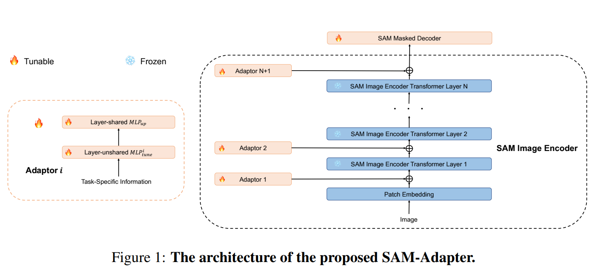
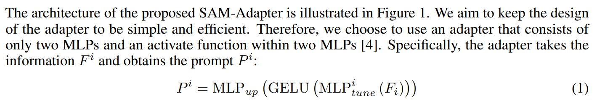

# SAM-Adapter

SAM-Adapter是首个将Adapter与SAM进行结合的结构，并在阴影检测和伪装物体检测上相交于之前的SoTA方法有较大的提升；

GitHub链接：[SAM-Adapter](https://github.com/tianrun-chen/SAM-Adapter-PyTorch)

## SAM-Adapter结构

网络结构：

由于原始SAM结构包含三部分，image encoder，prompt encoder和mask encoder。在SAM的基础上，SAM-Adapter只用了image encoder和mask encoder两部分，与SAM不同的是，SAM-Adapter添加了prompt信息，而prompt是根据原始任务确定的：

其中，MLP结构有权值共享和不共享两部分；image encoder部分的参数是固定的，最终的mask encoder是微调的；
在代码中，image encoder的参数是稍微有点区别的，因为中间有prompt信息，而mask encoder的代码则是与SAM的代码一致；
SAM-Adapter的代码集成在mmseg中；

## 训练过程

在SAM-Adapter的训练过程中，采用requires_grad_(false)函数将image encoder中的非prompt部分参数固定住，将该参数设置成不被跟踪；
