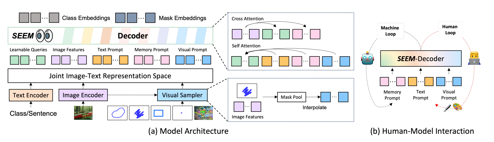
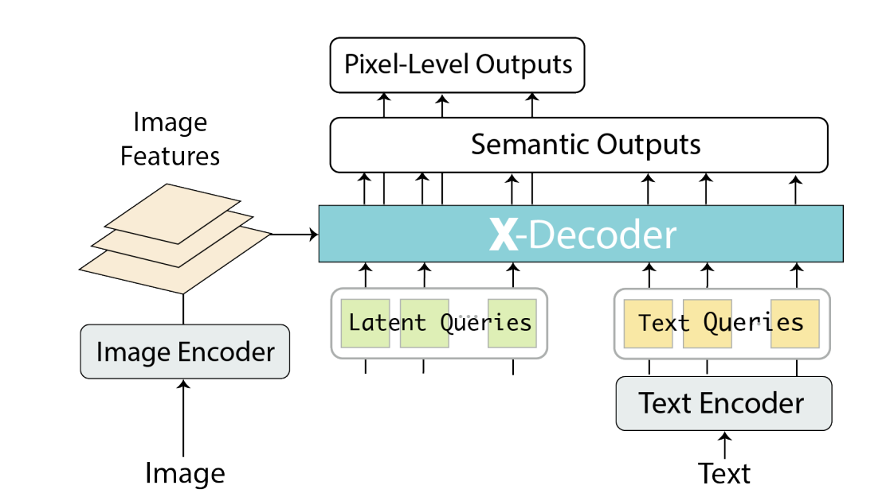
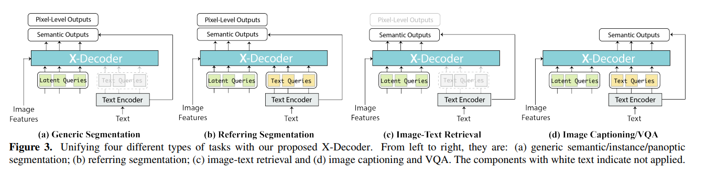

# SEEM

Code: [SEEM](https://github.com/UX-Decoder/Segment-Everything-Everywhere-All-At-Once/tree/v1.0)

## 代码运行

下载main分支代码，里面有demo代码；

```sh
python app.py
```

即可；

问题：没有pt文件；
**解决方法**：需要提前在提供的网址上将pt文件下载后放到demo_code文件夹下；
[Hugging Face SEEM](https://huggingface.co/xdecoder/SEEM/tree/main)

问题：缺少clip的相关文件；
**解决方法**：按照打印日志的提示将clip的相关文件下载，放到openai/clip-vit-base-patch32文件夹中；
[Hugging Face openai clip-vit-batch-patch32](https://huggingface.co/openai/clip-vit-base-patch32/tree/main)

问题：cannot import name 'distance_transform' from 'kornia.contrib'
**解决方法**：
Windows系统：[Microsoft](https://link.zhihu.com/?target=https%3A//www.microsoft.com/en-us/download/details.aspx%3Fid%3D57467)选择下载；
Linux系统：

```sh
sudo apt-get install mpich
```

问题：module 'whisper' has no attribute 'load_model'
**解决方法**：

```sh
import whisper
print(whisper.__file__)  # 会发现为空的

pip uninstall whisper
pip install git+https://github.com/openai/whisper.git 
```

注意whisper的git地址，别下载错了；

问题：gradio __init__() got an unexpected keyword argument 'source' 或者 gradio keyerror dataset
**解决方法**：gradio版本不对，之前根据requirement下载的3.31.0会出现后面的错，就更新为3.37.0

```sh
pip install gradio==3.37.0
```

## 文章阅读

工作的4个需求：
1. 多样性。提出了一种新的视觉提示统一不同的空间查询，包括点、框、涂鸦、掩码，进一步推广到不同的参考图像；
2. 成分。学习了文本和视觉之间的联合视觉语义空间，有助于各种分割任务所需的两种提示类型的动态组合；
3. 互动。进一步在解码器中加入可学习记忆，通过掩码引导的交叉注意力保留分割历史；
4. 语义信息。引入文本编码器，将文本查询和掩码标签编码到相同的语义空间，用于开集分割识别；



贡献点：
1. 设计了一种新的提示方案，将各种用户意图在联合视觉语义空间中转换为提示，为各种分割任务提供了灵活的提示和组合提示；
2. 构建了SEEM，一种通用的可交互的接口，将新设计的提示机制结合到轻量解码器中；
3. 在开集通用分割、交互分割、参考分割、结合多种提示的分割任务上都有很好的效果；


## Decoder

X-Decoder: [https://x-decoder-vl.github.io/](https://x-decoder-vl.github.io/)

贡献点在于提供一种decoder方式统一视觉和文本之间的联系；

文中所采用的结构：



对影像特征通过X-Decoder进行输出；

可用于generic segmentaion, referring segmentation, image-text retrieval, image captioning/VQA。


