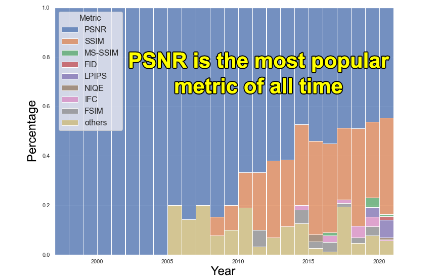
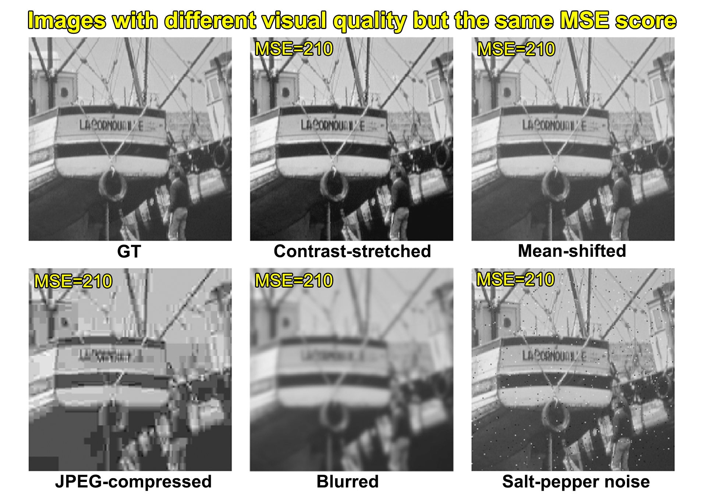
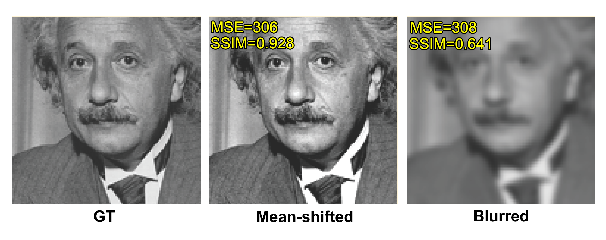
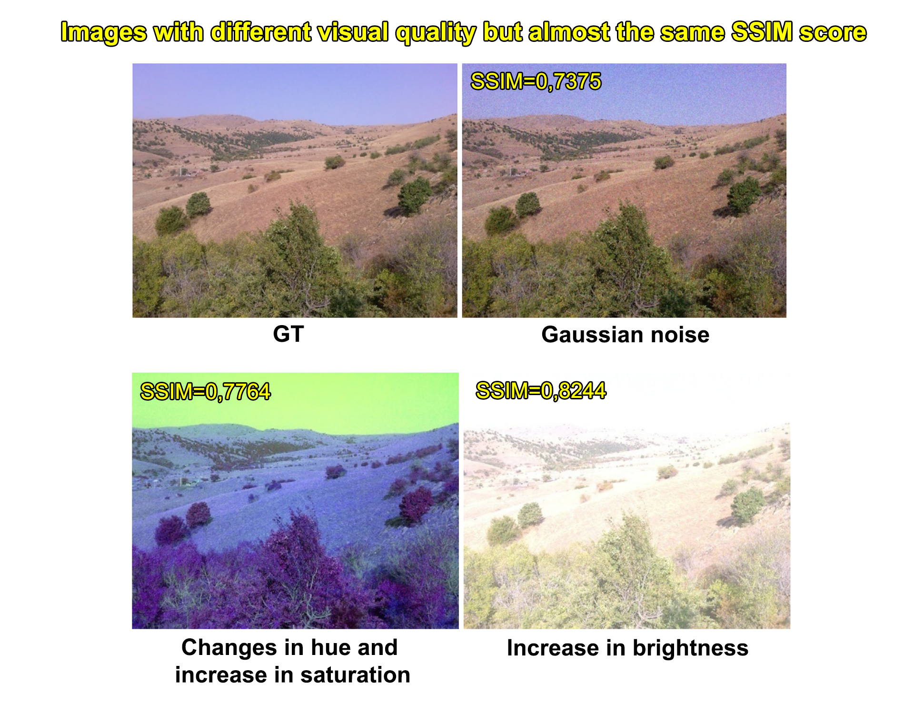
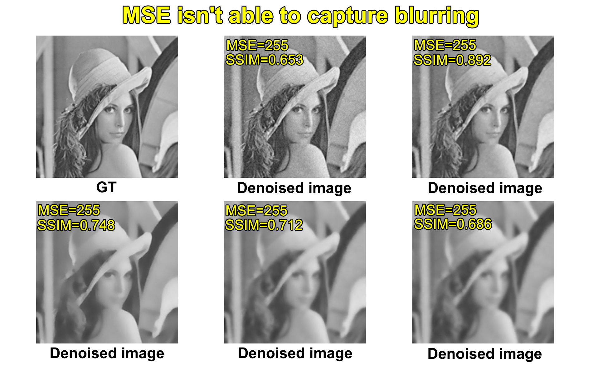
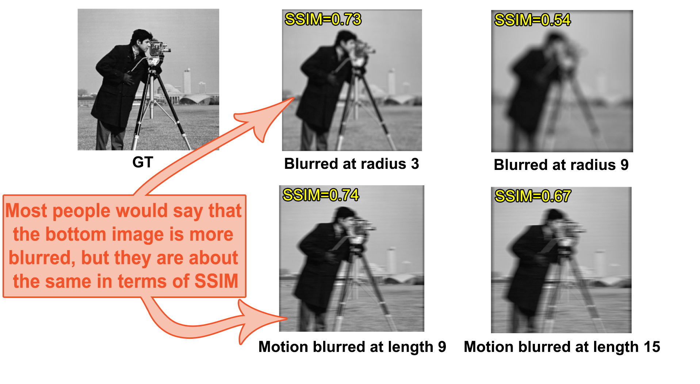

# 关于指标的欺骗方式

本笔记翻译于 [Ways of cheating on popular objective metrics: blurring, noise, super-resolution and others](https://videoprocessing.ai/metrics/ways-of-cheating-on-popular-objective-metrics.html)

## 引言

在超分辨率论文中，PSNR始终是估计SR图像的最流行标准，始终占主导地位。

PSNR指标的流行与其特征有关：
* 易于计算，指标的运行时间是许多实际应用程序的关键因素；
* 使用历史悠久，经历了长时间实验的验证。很容易将新算法的性能与仅使用PSNR评估的旧算法进行比较；
* 具有明确的物理含义；
* 在数学含义上具有方便的优化方便；

## 著名的批评例子

下图中对原始图像进行不同类型的失真，包括对比度、压缩、模糊、噪声，并且从图像中可以发现改变后的图像具有明显不同的1视觉质量。但是，失真图像的MSE分数是相同的。

另一个例子是，MSE分数几乎相同，但正确图像的视觉质量要好很多，SSIM指标更真实地处理了这一点。

发生这种情况的原因在于SSIM能够衡量结构相似性，而MSE则没有。这是SSIM与PSNR的真正区别。人类视觉系统对扭曲高度敏感。

然后，SSIM也会遇到与PSNR相同的问题，仍然会出现SSIM分数相同，但视觉质量差异很大的情况；

## 模型

很多时候图像的退化过程中存在模糊的影像，但是对于模型的图像，MSE无法评断图像的好坏，这个时候SSIM则能更准确地反映这一事实。

但是SSIM估计模糊量的能力也存在一些不确定的情况，比如下图中SSIM为0.73和0.74的情况不清楚它们在模糊方面是否大致相同，大多数人会觉得SSIM=0.74的图像更模糊。

因此有研究证明在将指标用作优化网络模型的目标时，基于DIST和LPIPS指标在去模糊任务中由于其他IQA（图像质量评估）模型。

## 噪声

MS-SSMI在去噪任务上优于其他的IQA模型；

## 总结

PSNR指标不是质量评估的良好指标，有太多参数高度影响PSNR值，几乎不影响视觉质量。另一方面，与PSNR指标相比，SSIM指标具有更好的性能，但SSIM对亮度、对比度、色调和饱和度的变化几乎不敏感。

然后，工业界和研究人员仍然普遍使用经典方法，尽管有很多批判，这并不意味着有些方法是坏的，有些是好的，只需明确定义任何指标的适用性边界。根据研究：

PSNR适用于：

* 测试不同的编解码器优化策略，旨在最大限度地提高指定内定的主观质量（即优化之前的内容保持不变）；
* 捕获噪音；
* 捕捉亮度、对比度、色调和饱和度的变化；

但不能应用于：

* 估计与内容相关的失真；
* 捕捉模糊；
* 当内容在测试之间保持不变时测试不同的编解码器质量；
* 超分辨率算法的质量评估；
* 捕获旋转和空间偏移；

SSIM适用于：

* 估计与内容相关的失真；
* 捕获噪音；
* 捕捉模糊；

但不能应用于：

* 超分辨率算法的质量评估；
* 捕获旋转和空间偏移；
* 捕捉亮度、对比度、色调和饱和度的变化；
