# Vision Transformer

注：
笔记图片来自于李宏毅老师课程网站：[https://speech.ee.ntu.edu.tw/~hylee/ml/2021-spring.php](https://speech.ee.ntu.edu.tw/~hylee/ml/2021-spring.php)
参考了李沐老师的论文讲解视频：[https://www.bilibili.com/video/BV1pu411o7BE?spm_id_from=333.337.search-card.all.click](https://www.bilibili.com/video/BV1pu411o7BE?spm_id_from=333.337.search-card.all.click)

## Self-attention

常见的模型：输入是一个向量(vector)，输出是一个数值(scalar)，这种情况属于回归(regression)，或者输出是类别(class)，这种情况属于分类(classification)；

那么当输入更复杂的情况下，比如输入时向量的集合时，一排向量，并且每一个向量的长度都是不一样的，输出是一排数值或者一排类别；

模型的输入：

* 比如说文字处理，模型的输入肯定会是一个句子，句子的长度是不固定的，句子中的每一个单词用一个vector来表示，句子就可以用很多个vector来表示，就是所谓的sequence；用vector来表示词汇的一种方法是One-hot Encoding，将英文中的所有单词都列举出来，长度M，然后创造一个长度为1*M的一维向量，出现这个单词的位置置为1，其余位置0；**缺点：只考虑到怎么用向量表示单词，忽略了单词之间的语义信息，比如cat、dog都表示动物，那么就有一种Word Embedding的技术，将语义信息相近的单词表示得更为接近；**
* 用一排向量来表示的例子还有很多：语音、图(graph, eg social network)

模型的输出：

* 输出与输入长度一致：词性标识(判断句子中每个单词的词性)、图结点预测(比如给定一个social network，然后判断里面每一个是否可能会买某种商品之类的)；
* 输出与输入长度不一致：
  * 输出长度为1：句子判断(比如判断某个句子是褒义的还是贬义的)、人的语音识别(判断一段语音是谁说的)；
  * 模型自行决定输出长度：翻译

以输出与输入长度一致为例：

就是要对输入的sequence中的每一个vector都输出一个label，这种情况称为Sequence Labeling。下图中针对这个句子输出每个单词的词性，可以直接对每一个vector都输入到FC中，然后输出label；但是这样的问题就没有考虑到某个单词在不同的位置可能具有不同的词性，例子中第一个saw是动词，看见的过去式，最后一个saw是名词锯子，显然对每一个vector都进行FC不可能对单词saw会有不同的结果，然后就考虑使用上下文信息；考虑用一个窗口(window)，每次都会考虑这个窗口中的vector的信息；但是，有时候需要考虑整个sequence的信息，这就时候就需要一个window将整个sequence进行覆盖住，就需要优先遍历一遍所有的sequence，用最长的长度构建一个window，这样就会导致参数过大，容易过拟合；

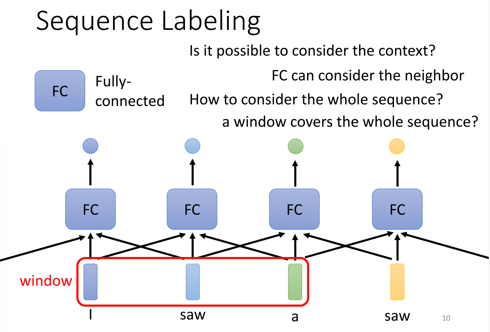

**那么就需要使用一种Self-attention的技术来考虑整个sequence的信息**；self-attention是transformer中一个重要的module；对于输入的sequence，经过self-attention之后有多个不同的带有全局上下文信息的输出，然后经过FC；那么这种self-attention也是可以堆叠的，经过FC层之后再堆叠self-attentioon；

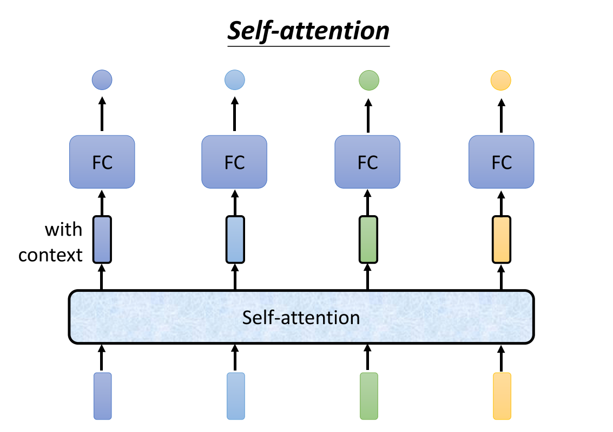

self-attention计算过程：

主要原理：

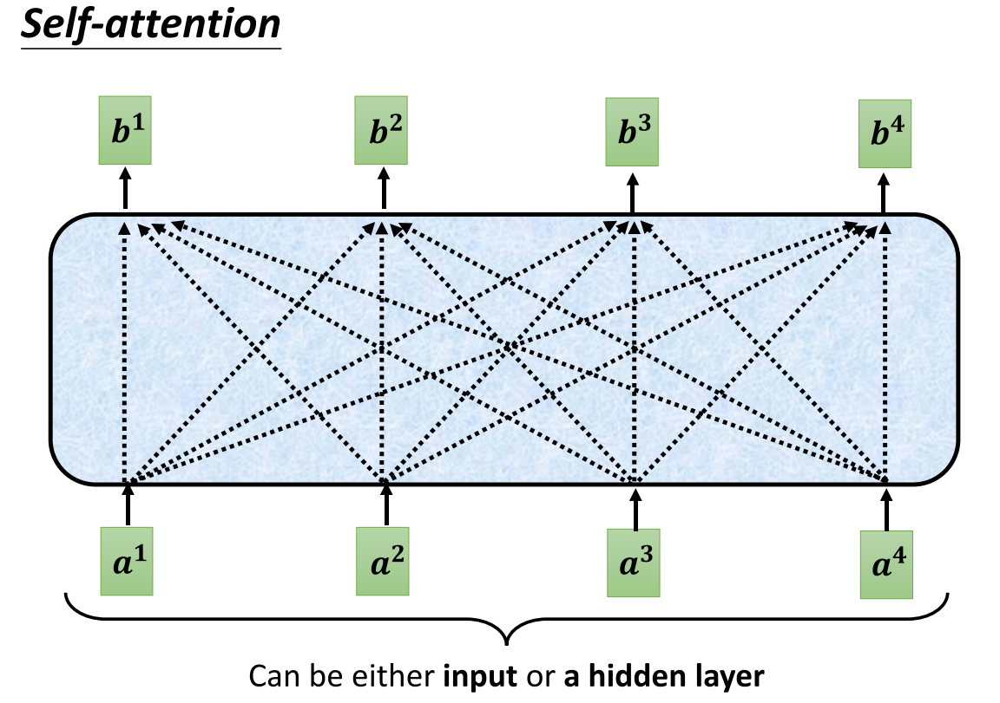

$a^1$ $a^2$ $a^3$ $a^4$是输入或者某一层的输出，经过self-attention模块之后得到$b^1 b^2 b^3 b^4$，那么在该过程中需要考虑输入$a^1、a^2、a^3、a^4$之间的相关程度，那么在衡量两个向量之间的程度有很多中方式，只要输入是两向量，然后输出一个值就可以；在transformer中应用的Dot-product操作，就是第一个向量乘以$W^q$矩阵得到q，另一个向量乘以$W^k$矩阵得到k，然后element wise的乘法得到$\alpha$；右边是另外一种方式，先不用管；

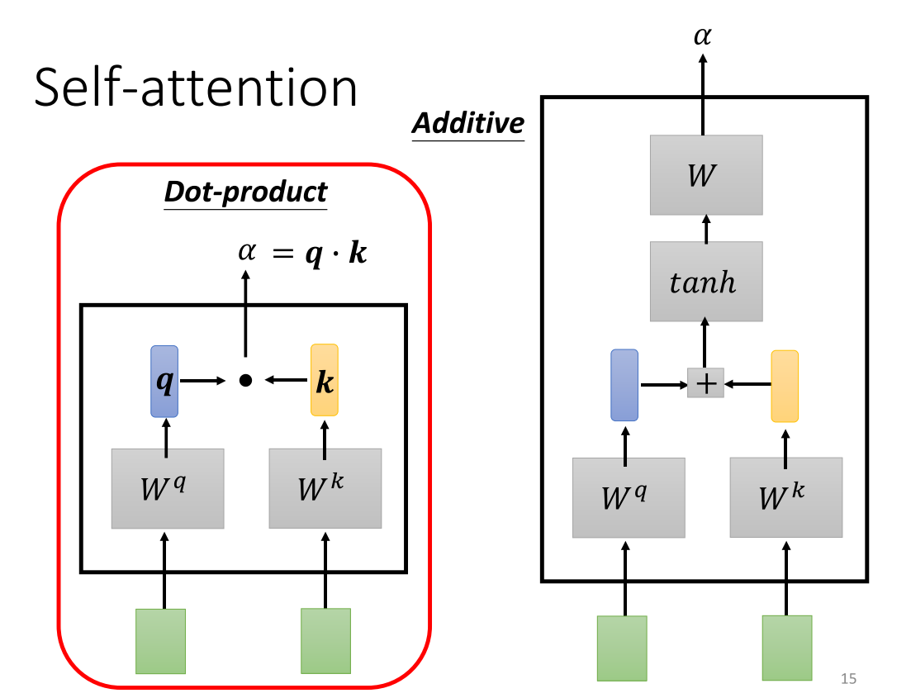

计算过程：

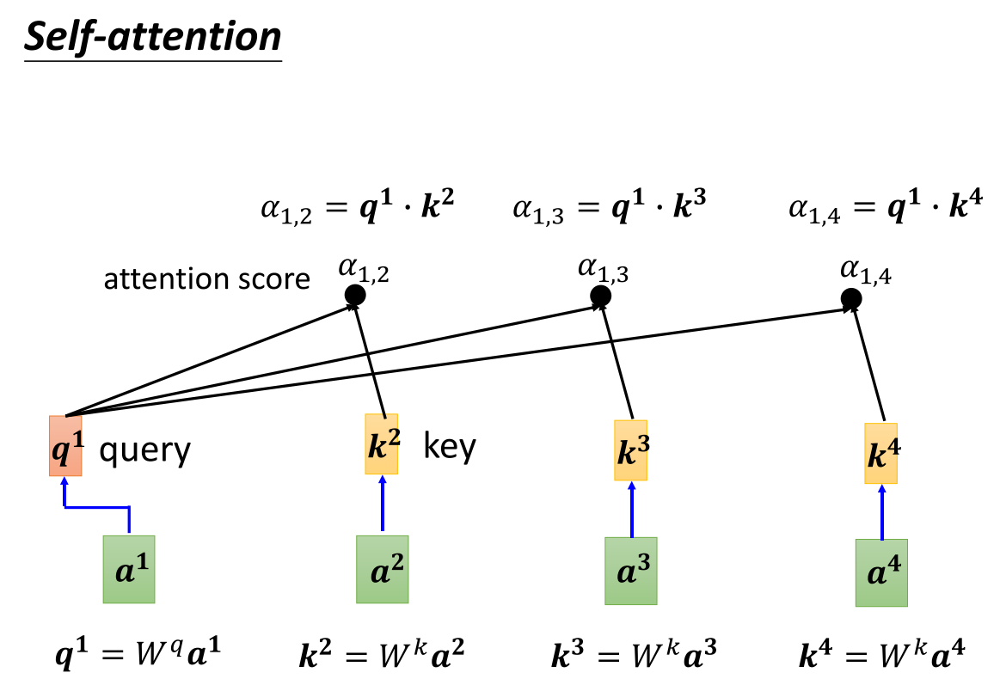

对于输入$a^1、a^2、a^3、a^4$，以$a^1$为例，乘以矩阵$W^q$得到$q^1$，对其余的向量乘以$W^k$得到k，然后q与k做Dot-product，得到 $\alpha_{1,2}$ 表示 $a^1、a^2$之间的相关性，其他同理类似；**与$a^1$自身计算相关性也是可以的**；对计算的结果经过softmax，或者其他的操作都行，反正是做个normalization操作；

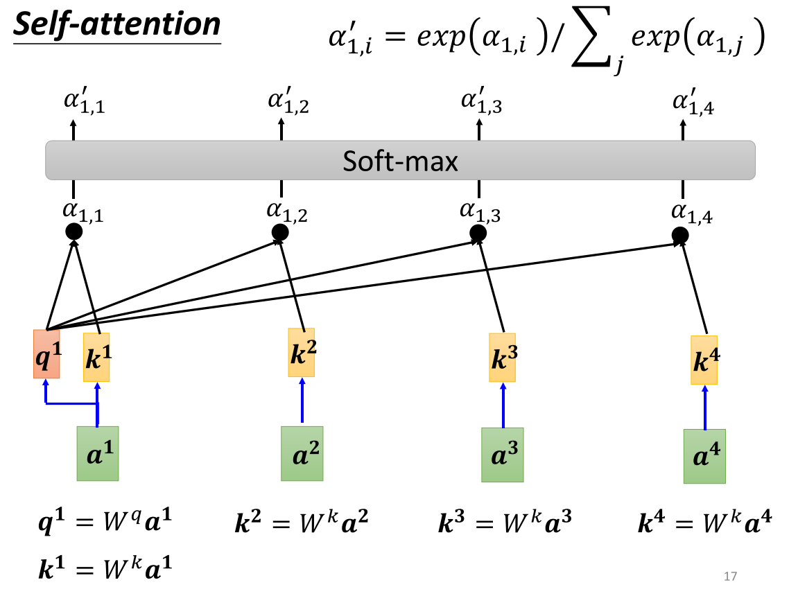

在得到$\alpha^{'}_{1,1}$这几个数值之后，然后与每个向量的v矩阵进行相乘求和得到b输出；

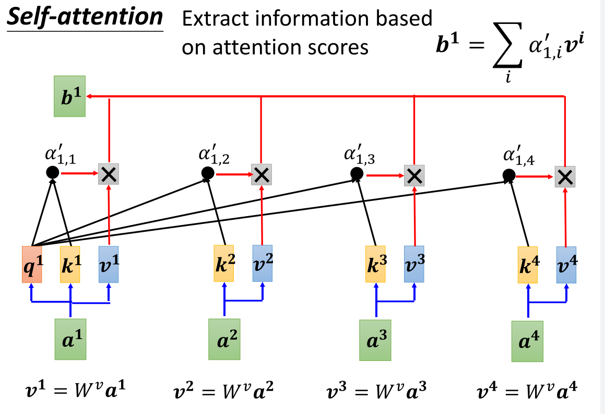

总结：

总的来说，对于self-attention的计算流程，就是分别计算q、k、v三个矩阵，具体理解过程可以看李宏毅老师的pdf，最后只有$W^q、W^k、W^v$三个矩阵是需要模型学习出来的；

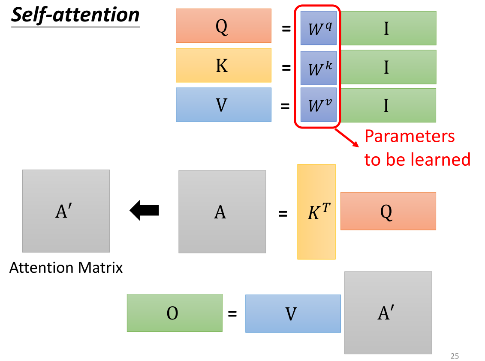

多头注意力机制(Multi-head Self-attention)

考虑到了多种不同的相关关系，计算不同的qkv值，然后计算b值，不同的b值然后通过一个可学习的矩阵得到最后的b；这里的head的数目是一个超参数，依据不同的问题自己决定；**这里的multi-head机制从矩阵计算的角度来看是李宏毅老师讲解的将原始的q矩阵乘以不同的矩阵获取q1、q2，李沐老师讲解的论文中从理解的角度上来看是通过线性映射到不同维度的空间上进行计算，不然Dot-Product操作中其实就只有矩阵相乘而没有其他的需要学习的参数；**

但是这种self-attention结构缺乏位置信息，比如说在上面计算输入的向量之间的相关性的时候，任意两个向量交换位置对最后计算的b值是没有影响的；因此，可考虑引入位置信息；

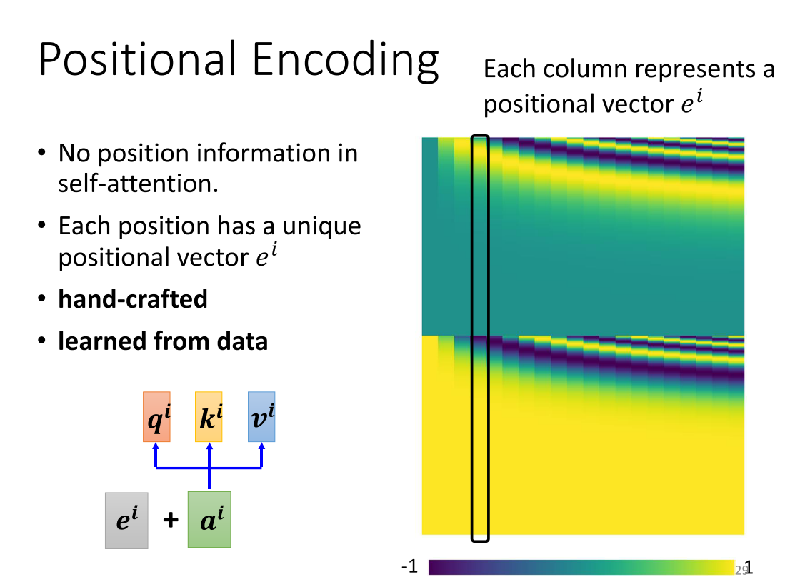

Self-attention可以应用于其他领域中；

在Speech中应用Truncated Self-attention；

在Image中应用Self-attention，将每一个像素值(包含三个不同的通道值)看成是一个vector；那么这样就可以理解成，self-attention是一种更复杂CNN，CNN是简化的self-attention，因为CNN只能注意到receptive field中的信息，而self-attention可以在整张图片上查找信息；

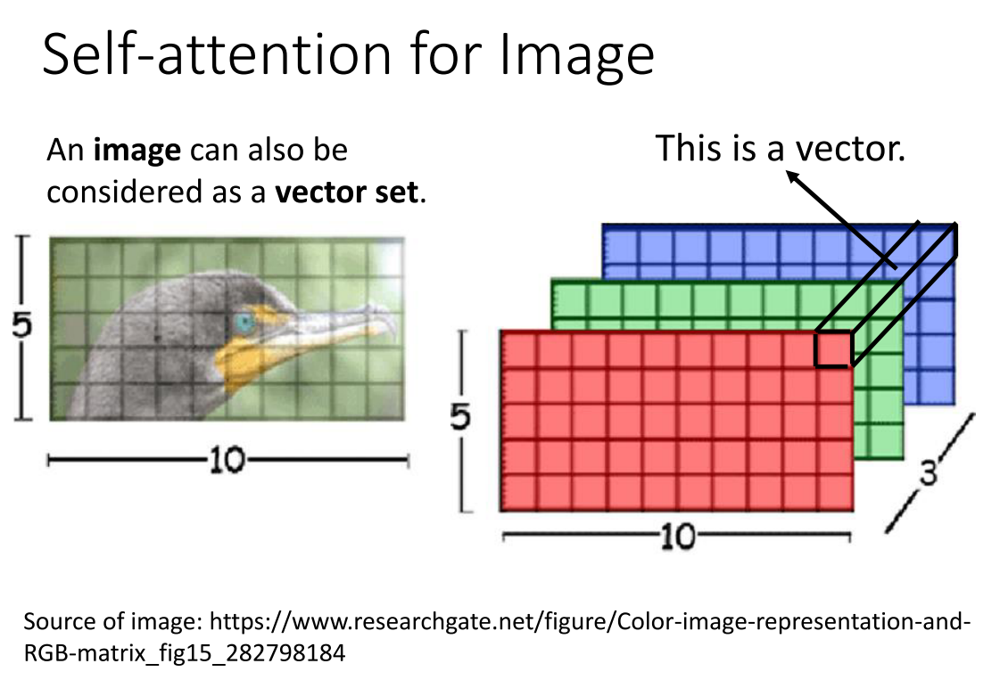

Self-attention与RNN的不同之处这里略，因为我对RNN也不是很了解；

## Transformer

Sequence-to-Sequence(Seq2Seq)，输入是sequence，输出是sequence，输出的长度由模型决定；一般的Seq2seq模型包含两个部分，Encoder和Decoder两个部分，现在基本上提到Seq2seq都会想到Transformer，以往的不是Transformer；

Encoder：

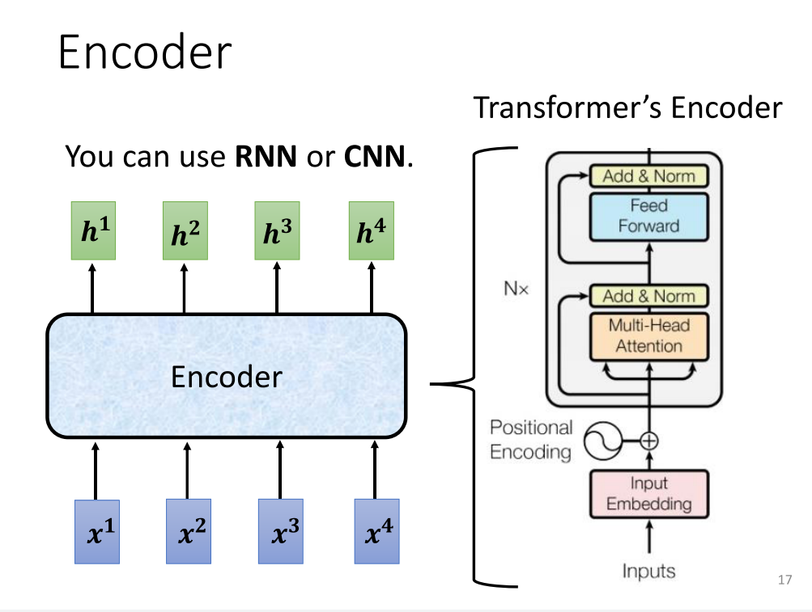

对于Encoder部分，其实就是给定一排向量，输出一排向量，那么很多模型都能做到，RNN、CNN、self-attention都能；对于Transformer’s Encoder，使用的是self-attention；

对于encoder中的每一个block，Transformer中是这样计算的：对于输入的一排向量，经过self-attention计算之后得到的值，经过一个残差连接，然后经过一个layer normalization，经过FC，再使用残差连接和layer normalization得到输出；

这种self-attention和layer normalization的使用顺序，这里是按照Attention Is all you Need论文中讲解的，后面也有文章针对这个不同搭配进行研究的；

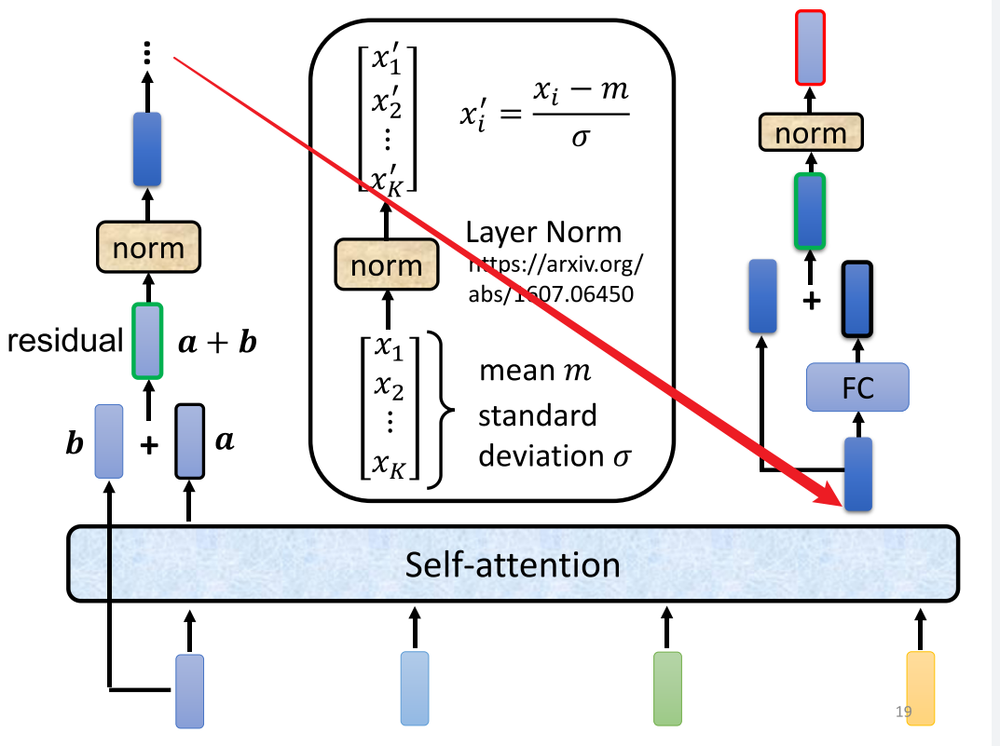

对于Decoder部分，将Encoder的输出进行计算得到output sequence；

Decoder的一种架构是Autoregression(AT)

首先需要给定一个START的字符，然后通过Decoder，预测下一个字符是机，这里得到机字的过程是Decoder得到一个很长的向量，总长度应该是要预测的所有字符的长度，然后取里面概率最大的那个值；然后依次将预测的字作为输入放到Decoder中去，依次预测到器字、学字、习字；

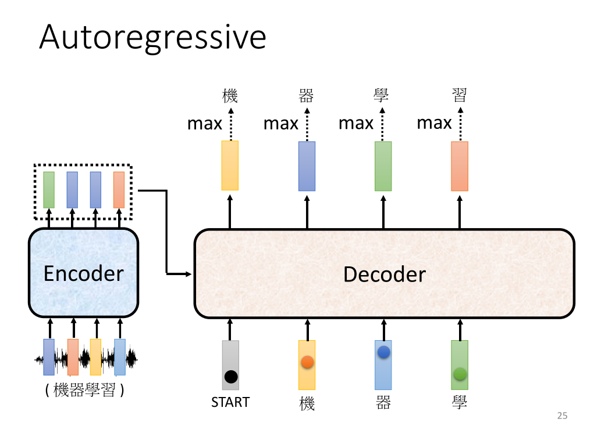

那么在Decoder的结构中，先不考虑来自Encoder的输出，Decoder的结构与Encoder类似，但是Decoder中第一步使用了Masked Multi-Head Attention；

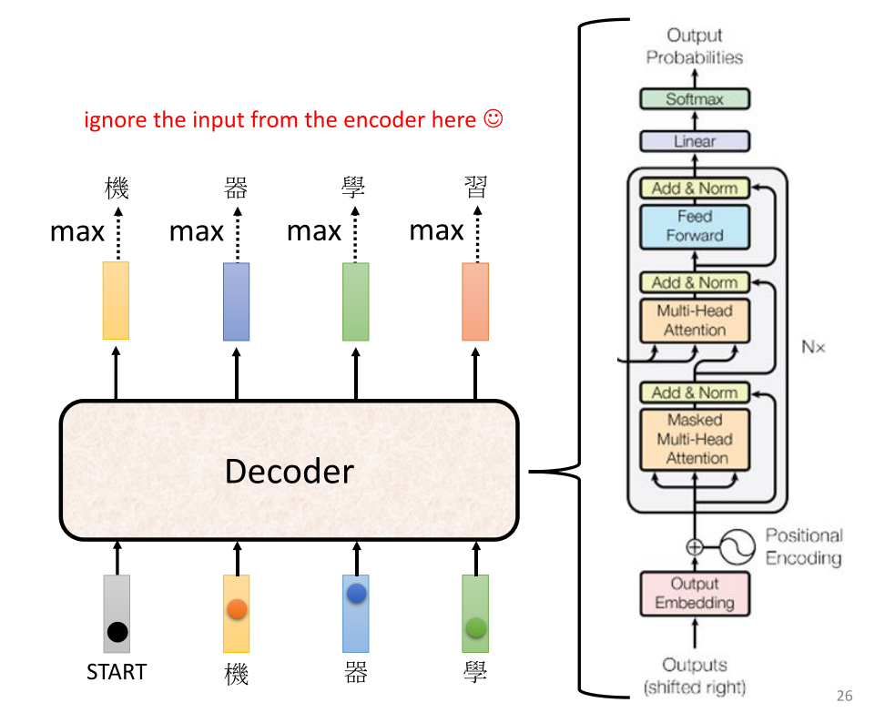

Masked Multi-Head Attention结构：就是在计算self-attention的时候，不能考虑之后的值之间的联系，就是在计算b2的时候，不能考虑a3、a4，因为这个时候Decoder中还没有a3、a4；

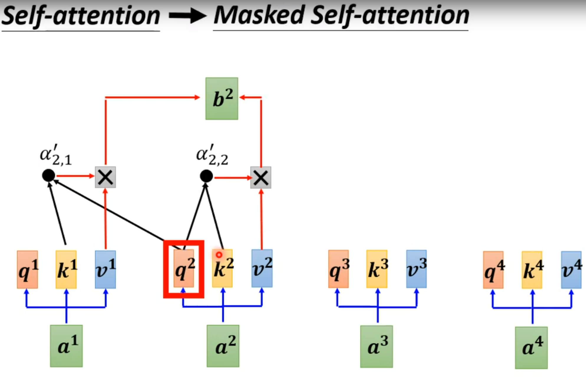

好，那么目前Decoder中还存在的问题是，如果中间预测一步错的话，后面可能会导致每一步的结构都是错误的，并且模型还得自己决定output sequence的长度，针对输出长度的问题，需要添加一个结束词，当模型输出到这个词的时候，就是结束的时候；

Decoder的另一种架构是Non-autoregression；

Transformer的结构：

需要注意的是中间标注出的Cross-attention，这是Decoder获取Encoder中的输出信息的桥梁；

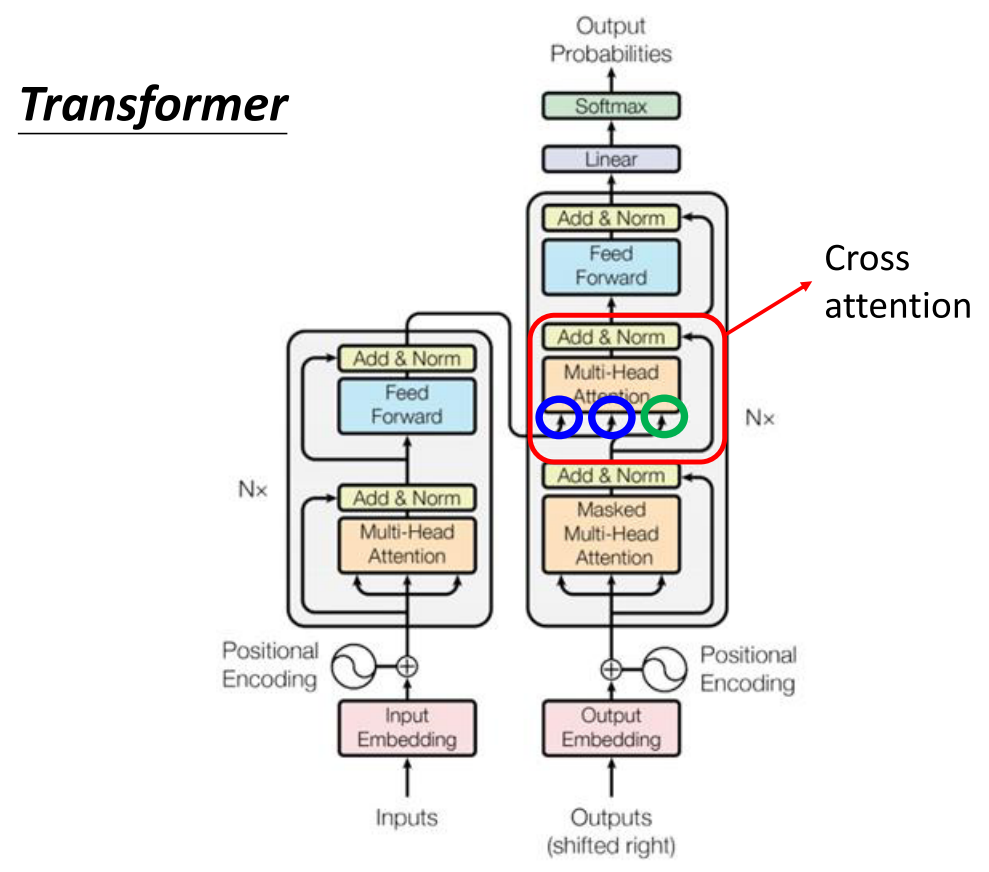

计算过程：

Decoder中对START进行Self-attention之后，抽取q矩阵，与Encoder中的信息提取出的k、v矩阵计算相关性，然后经过FC作为下一个block的输入；对第二个预测也是一样，用的是Masked Self-attention；那么这种Cross Attention还可以有许多变种；

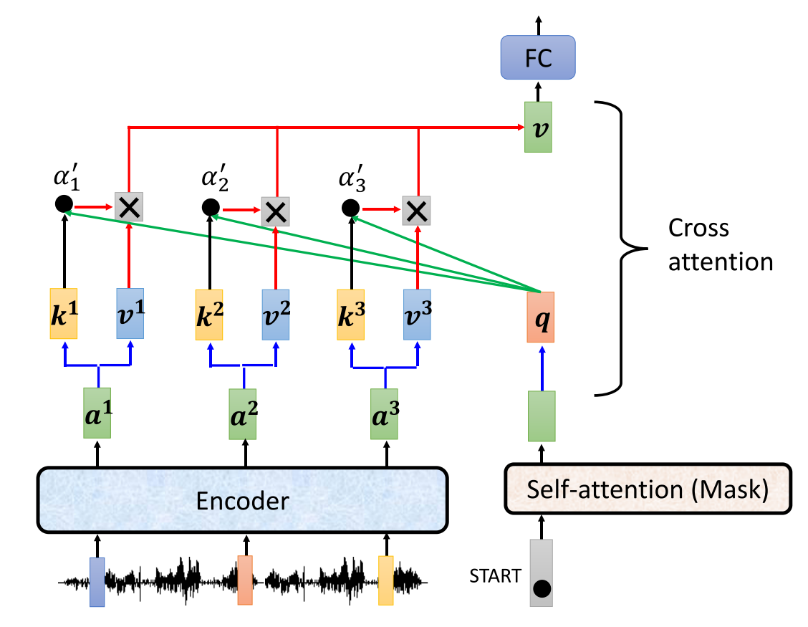
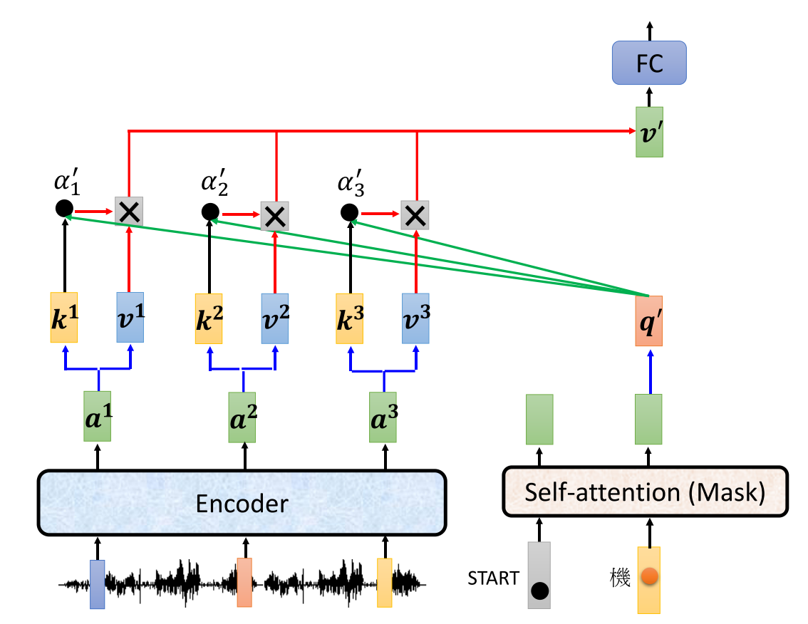

训练过程中的损失函数cross entropy：

需要注意的在之前说到的Decoder依次预测机、器、学、习四个字，这是针对预测而言的，预测是用前面预测的字进行Decoder预测后面的字，但训练的时候，我们使用Ground Truth作为Decoder的输入，也就是我们希望输入机字时，输出是器；

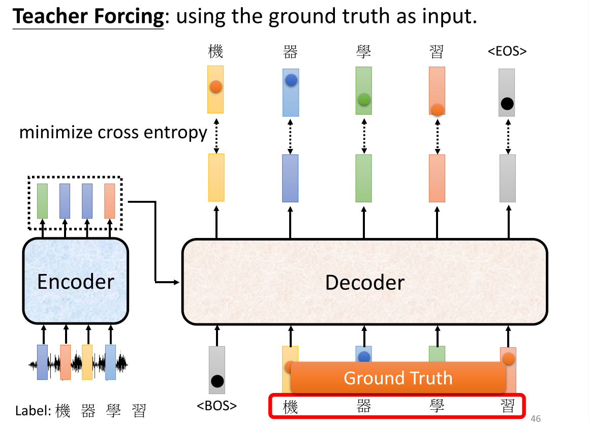
